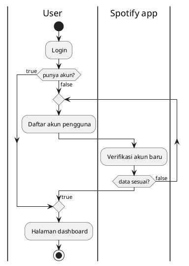
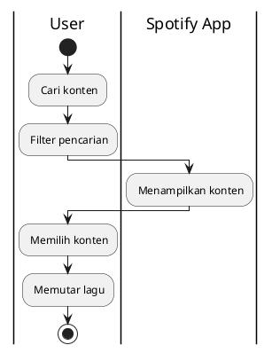
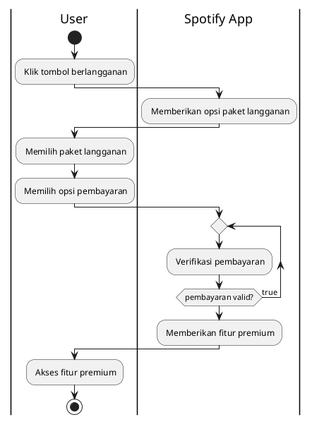

# Activity diagram of Spotify

> You can see all the activity diagrams in this link [klik me!](Activity%20diagram%20of%20Spotify\plantuml-code)
## Login

```plantuml
@startuml

| User |
start
: Login;
if (punya akun?) then (true)
else (false)
    repeat
    : Daftar akun pengguna;
    | Spotify app |
    : Verifikasi akun baru;
    repeat while (data sesuai?) is (false)
    -> true;
endif
| User |
: Halaman dashboard;
stop

@enduml
```

## Search content

```plantuml
@startuml

| User |
start
: Cari konten;
: Filter pencarian;
| Spotify App |
: Menampilkan konten;
| User |
: Memilih konten;
: Memutar lagu;
stop
@enduml
```

## Subscription

```plantuml
@startuml

| User |
start
: Klik tombol berlangganan;
| Spotify App |
: Memberikan opsi paket langganan;
| User |
: Memilih paket langganan;
: Memilih opsi pembayaran;
| Spotify App |
repeat
    : Verifikasi pembayaran;
repeat while (pembayaran valid?) is (true)
: Memberikan fitur premium;
| User |
: Akses fitur premium;
stop

@enduml
```