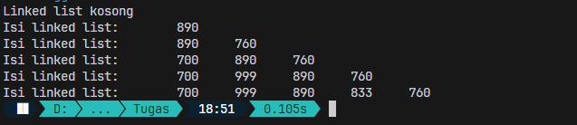
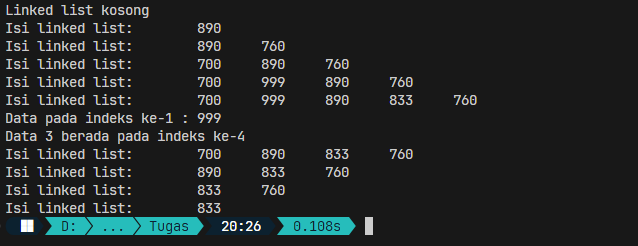
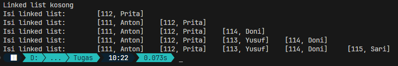
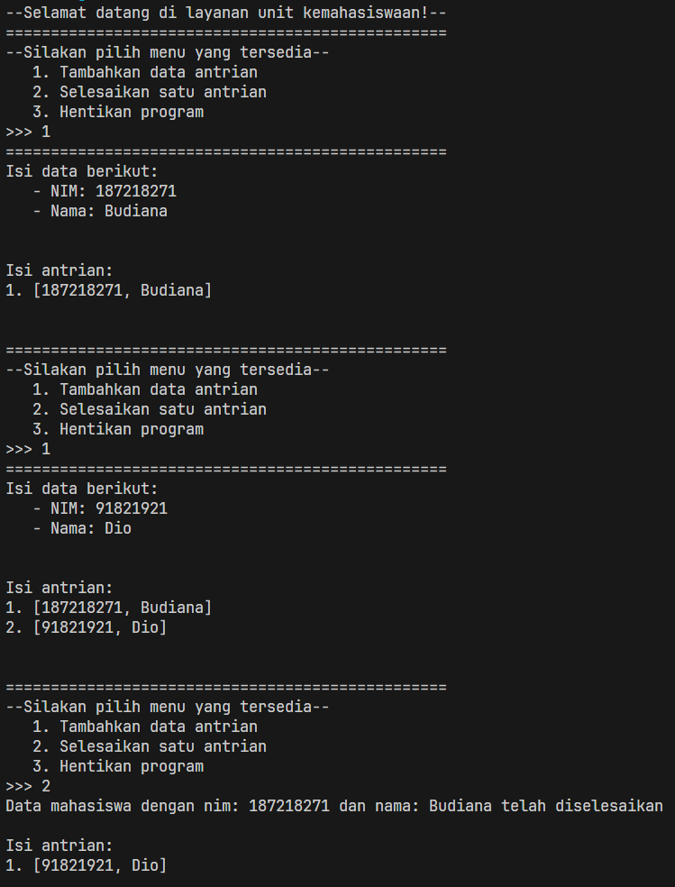
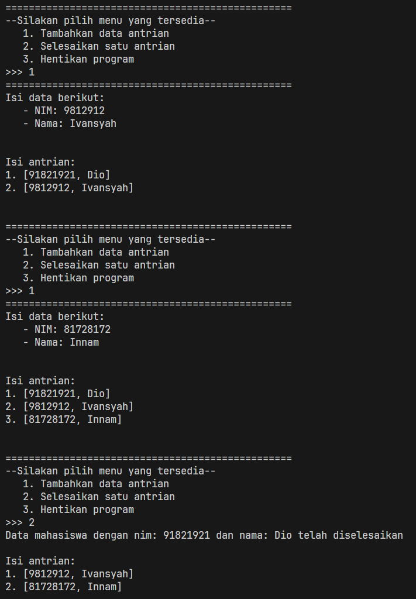
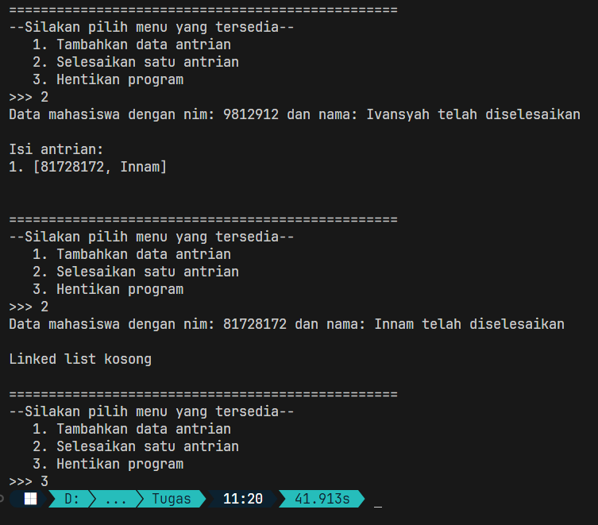

<div align="center">

# Laporan Praktikum Algoritma dan Struktur Data
## Pertemuan 8


\
Nama: Farrel Augusta Dinata

NIM: 2341720081

No. Absen: 12

Kelas: TI-1B

</div>

---
## Percobaan 1
Verifikasi hasil dari program yang telah dibuat:



**Pertanyaan:**

1. Mengapa hasil compile kode program di baris pertama menghasilkan "Linked List Kosong"?
    
    Jawab: Itu karena pada struktur data linked list masih belum menampung data apapun. Itu bisa dibuktikan pada method `isEmpty` yang menunjukkan bahwa nilai dari head adalah `null` yang berarti masih belum ada nilai. Jika di node `head` saja belum ada nilai, maka sudah dipastikan tidak ada data lagi seterusnya.

2. Jelaskan kegunaan variable temp secara umum pada setiap method!

    Jawab: Variabel temp bisa berguna untuk menyimpan data node secara sementara. Misalnya, temp menyimpan di node head, kemudian beralih lagi ke node dengan index 1 hingga seterusnya. Dengan demikian, nilai dari data-data yang lain tidak berubah. 

3. Perhatikan class `SingleLinkedList`, pada method `insertAt` jelaskan kegunaan kode berikut:
    ```java
    if (temp.next.next == null) tail = temp.next;
    ```
    Jawab: Kode tersebut berfungsi untuk memperbarui nilai dari tail. Untuk cara kerjanya akan mengecek atribut `next` dari `temp.next` apakah `null`. Jadi misalkan, variabel `node` berada di indeks 3, maka `temp.next` akan diarahkan ke indeks 4. Dengan begitu, `temp.next.next` akan berada di indeks 5. 

    Kalau nilai node di indeks 5 adalah `null`, maka nilai variabel `tail` akan diperbarui menjadi di indeks ke-4. Proses pembaruan `tail` ini akan dilakukan setiap kali terjadi penambahan data. 

---
## Percobaan 2
Verifikasi hasil output dari program yang telah dibuat:


**Pertanyaan:**
1. Mengapa digunakan keyword `break` pada fungsi `remove`? Jelaskan!

    Jawab: Keyword `break` tersebut berfungsi untuk menghentikan proses perulangan yang terjadi untuk menentukan data yang sesuai dengan data yang dicari. Jadi, ketika data sudah ditemukan, maka di saat itu juga proses perulangan sudah tidak akan dilanjutkan lagi.

2. Jelaskan kegunaan kode di bawah pada method remove
    ```java
    else if (temp.next.data == key) {
        temp.next = temp.next.next;
    }
    ```
    Jawab: Kode tersebut berfungsi memperbarui nilai `temp.next` sesuai dengan `temp.next.next`. Jadi, nilai yang sudah ada di `temp.next` akan tergantikan dengan data di `temp.next.next`.

---
## Tugas
1. Implementasikan ilustrasi linked list berikut! Gunakan 4 macam penambahan data yang telah dipelajari sebelumnya untuk menginputkan data!

    Jawab: Hasil yang dihasilkan dari program yang dibuat:

    
    
    Untuk detil program yang saya buat bisa cek di link berikut: [Klik aku](TugasAkhir/Nomor1/)

    Alur penambahan data yang saya lakukan adalah menggunakan method `addFirst` dengan nilai `[112, "Prita"]`. Kemudian saya menggunakan kembali `addFirst` untuk data `[111, "Anton"]`. Data tersebut akan menggeser nilai `head` yang semula ada di nim: 112 menjadi 111.
    
    Selanjutnya menggunakan method `insertAfter` untuk menambahkan data setelah data dengan nim: 112. Data keempat menggunakan method `insertAt` untuk menambahkan data di indeks ke-2. Dan yang terakhir adalah menggunakan method `addLast` dengan detil data: nim=115, nama="Sari".


2. Buatlah implementasi program antrian layanan unit kemahasiswaan sesuai dengan kondisi yang ditunjukkan pada soal nomor 1! Ketentuan:
    - Implementassi antrian menggunakan Queue berbasis linked list!
    - Program merupakan proyek baru, bukan modifikasi dari soal nomor 1!

    Jawab: 
    Hasil program yang saya buat
    
    
    

    Untuk membuat sebuah struktur data linked list dengan berbasis Queue, maka poin utama yang harus dilakukan adalah data hanya bisa ditambahkan di akhir dan data akan keluar jika data tersebut sudah berada di bagian depan. Maka dari itu, implementasi program ini saya menggunakan method `addLast` untuk menambahkan data dan `removeFirst` untuk menghapus data di bagian depan barisan (Untuk penamaan method sudah saya rubah).

    Untuk method yang lain, seperti `getData` dan `indexOf` sudah sesuai dengan konsep Queue yaitu mengakses data dari bagian depan hingga ke belakang. Selebihnya tidak ada perubahan sama sekali.

    Agar program lebih menarik, saya membuat program ini bisa digunakan input dari pengguna. Saya membuatkan menu yang bisa dipilih sesuka hati pengguna. Ada 3 opsi menu, 1) Menambahkan data, 2) Menyelesaikan data/menghapus data bagian depan, dan 3) Menghentikan program. Masing-masing dari opsi tersebut saya buatkan method tersendiri di dalam class `SLLMain`.