<div align="center">

# Laporan Praktikum Algoritma dan Struktur Data
## Pertemuan 8


\
Nama: Farrel Augusta Dinata

NIM: 2341720081

No. Absen: 12

Kelas: TI-1B

</div>

---
## Percobaan 1
Verifikasi hasil percobaan:

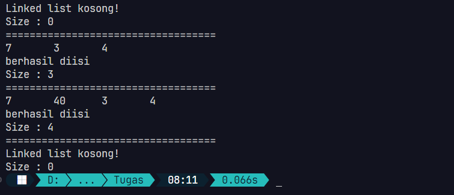

**Pertanyaan:**
1. Jelaskan perbedaan antara single linked list dengan double linked list!

    Jawab: Pada struktur data single linked list, hanya ada satu pointer di tiap-tiap node. Sedangkan pada double linked list terdapat dua pointer yang menunjukkan alamat node sebelum dan selanjutnya. Dengan demikian, jika dilakukan proses searching atau proses algoritma lain bisa dilakukan dari arah manapun. Bisa dimulai dari titik awal node double linked list atau dimulai dari titik akhir node double linked list.

2. Perhatikan class Node, di dalamnya terdapat atribut next dan prev. Untuk apakah atribut tersebut?

    Jawab: Atribut next dan prev digunakan untuk menunjukkan node sebelum dan selanjutnya. 

3. Perhatikan konstruktor pada class `DoubleLinkedLists`. Apa kegunaan inisialisasi atribut head dan size seperti pada gambar berikut ini?
    ```java
    public DoubleLinkedLists() {
        head = null;
        size = 0;
    }
    ```
    Jawab: Atribut tersebut akan memberikan nilai awal pada head dan size saat proses instansiasi awal objek `DoubleLinkedList`. Ketika pertama kali instansiasi, data di double linked list pastinya kosong sehingga untuk menyatakan bahwa data itu kosong menggunakan atribut head bernilai null dan size bernilai 0.

4. Pada method `addFirst()`, kenapa dalam pembuatan objek dari konstruktor class Node prev dianggap sama dengan null?
    ```java
    Node newNode = new Node(null, item, head);
    ```
    Jawab: Pada struktur data double linked list, atribut prev akan merujuk pada node sebelumnya. Jika menambahkan data di awal, maka nilai prev pastinya null karena sebelum dari node baru yang akan ditambahkan tidak ada node lagi. 

5. Perhatikan pada method `addFirst()`! Apakah arti statement `head.prev = newNode`?

    Jawab: Statement tersebut akan memperbarui atribut prev yang ada pada node head sesuai dengan objek `newNode`. Itu karena sebelumnya sudah disiapkan node baru yang akan ditambahkan di awal struktur data double linked list. Node baru tersebut posisinya berada sebelum di node head saat itu.

6. Perhatikan isi method `addLast()`, apa arti dari pembuatan objek Node dengan mengisikan parameter prev dengan current, dan next dengan null?
    ```java
    Node newNode = new Node(current, item, null);
    ```
    Jawab: Pembuatan objek `newNode` tersebut adalah untuk menyiapkan node baru yang akan ditambahkan di bagian akhir struktur data double linked list. Nilai current tersebut sesuai dengan node yang berada di bagian akhir double linked list. Ketika menambahkan node baru di bagian akhir, maka pastinya belum ada node lagi di node selanjutnya. Maka dari itu, nilai dari argument next objek newNode tersebut adalah null.

7. Pada method `add()`, terdapat potongan kode program sebagai berikut:
    ```java
    while (i < index) {
        current = current.next;
        i++;
    }

    if (current.prev == null) {
        Node newNode = new Node(null, item, current);
        current.prev = newNode;
        head = newNode;
    } else {
        Node newNode = new Node(current.prev, item, current);
        newNode.prev = current.prev;
        newNode.next = current;
        current.prev.next = newNode;
        current.prev = newNode;
    }
    ```
    Jelaskan maksud dari bagian blok kode if statement!
    
    Jawab: Kode dari blok if statement tersebut hanya akan dijalankan ketika nilai atribut prev dari objek current bernilai `null` yang mana itu sudah pasti current berperan sebagai `head`. Mekanisme di dalam blok if statement itu adalah menambahkan data di depan `head` atau index 0 dari keseluruhan data yang ada. Karena di depan, maka saat melakukan instansiasi objek baru `newNode`, nilai argumen dari parameter `prev` adalah `null`. Untuk atribut `next`, akan diarahkan ke node `current`. Setelah itu, node baru yang sudah dibuat akan disambungkan dengan node `current`. Karena akan ditambahkan di depan, maka akan disambungkan dengan atribut `prev` dari objek `current`. Langkah terakhir adalah memperbarui posisi atribut `head` yaitu berada di node baru `newNode`.
---
## Percobaan 2
Verifikasi hasil percobaan:

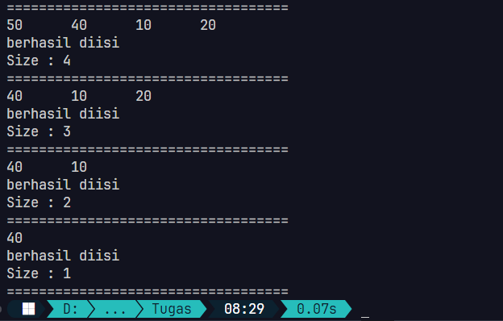

**Pertanyaan:**
1. Apakah maksud statement berikut pada method `removeFirst()`?
    ```java
    head = head.next;
    head.prev = null;
    ```
    Jawab: Kode tersebut akan menghapus node `head` yang lama dan menggantinya dengan node baru di depannya. Langkah pertama akan memindahkan pointer `head` yang lama ke node selanjutnya dengan `head = head.next`. Setelah itu, akan dihapus data yang ada di pointer `head` sebelumnya dengan memberikannya nilai `null`.


2. Bagaimana cara mendeteksi posisi data ada pada bagian akhir pada method `removeLast()`?
    Jawab: Untuk mengecek posisi data ada pada bagian akhir adalah melalui proses looping berikut:
    ```java
    while (current.next.next != null) {
        current = current.next;
    }
    ```
    Sebenarnya itu tidak langsung mengarah ke node paling akhir, melainkan ke satu node sebelum node terakhir. Jadi mekanismenya adalah mengecek apakah dua node ke depan `null` atau tidak. Jika iya, maka itu sudah berada di hampir paling akhir barisan node. Untuk menghapus data node paling akhir, maka tinggal hapus saja atribut next yang ada di node `current`. Ini membuat node yang paling akhir sudah tidak tersambung dengan node-node yang lain.

3. Jelaskan alasan potongan kode program di bawah ini tidak cocok untuk perintah `remove`!
    ```java
    Node tmp = head.next;
    head.next = tmp.next;
    tmp.next.prev = head;
    ```
    Jawab: Kode tersebut hanya bekerja untuk menghapus pada di indeks 1 atau satu node setelah `head`. Jadi, jika semula pointer `head` memiliki atribut `next` ke node pada indeks 1, maka akan langsung dilompati ke indeks 2. Kemudian atribut `prev` yang ada pada node indeks ke-2 akan diarahkan ke `head`. Jadi secara kode tersebut sifatnya kurang universal.


4. Jelaskan fungsi kode program berikut ini pada fungsi `remove`!
    ```java
    current.prev.next = current.next;
    current.next.prev = current.prev;
    ```
    Jawab: Kode tersebut akan memperbarui data atribut `prev` dan `next` yang dimiliki oleh node sebelum dan sesudah node `current`. Jadi misalkan terdapat 4 node yang berisi data 'A', 'D', 'E', 'K'. Kemudian diketahui bahwa node `current` berada pada data 'E'. Karena node `current` akan kita hapus, maka atribut `next` yang ada di node 'D' akan diubah untuk langsung menuju 'K'. Selain itu, atribut `prev` pada node 'K' akan diubah untuk langsung menuju node 'D'. Ini membuat node 'E' sudah tidak saling dikenali pada barisan struktur data double linked list. Sehingga penghapusan data dikatakan berhasil.

---
## Percobaan 3
Verifikasi hasil percobaan:

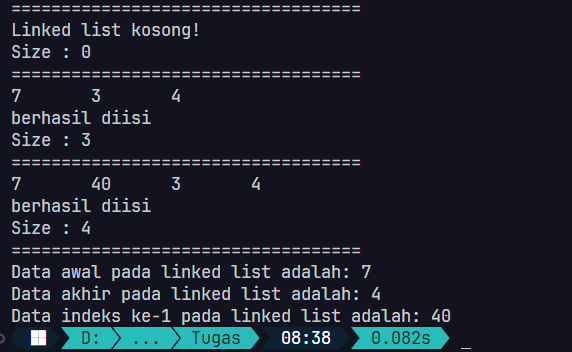

**Pertanyaan:**
1. Jelaskan method `size()` pada class `DoubleLinkedLists`!
    
    Jawab: Method `size()` digunakan untuk mengetahui berapa banyak node yang ditampung pada struktur data double linked list. Tapi menurut saya ini tidak perlu dibuatkan sebuah method. Kalau ingin tahu nilai size, maka tinggal langsung panggil saja atribut `size`. Contohnya seperti ini ketika melakukan pemanggilan atribut `size`: 
    ```java
    DoubleLinkedLists dll = new DoubleLinkedLists();
    System.out.println("Jumlah node yang ditampung: " + dll.size);
    ```
    Kode yang dibuat jauh lebih praktis dan tidak perlu membuat sebuah method baru.

2. Jelaskan cara mengatur indeks pada double linked lists supaya dapat dimulai dari indeks ke-1!

    Jawab: Kalau yang dimaksud adalah mencetak data dari indeks ke 1 hingga terakhir, maka bisa menggunakan kode berikut:
    ```java
    Node current = head.next; // Ini berarti node current akan dimulai satu data setelah node head
    int index = 1;
    System.out.printf("Data indeks ke-%d : %s", index, current.data);
    while (current.next != null) {
        System.out.printf("Data indeks ke-%d : %s", index, current.data);
        index++;
        current = current.next;
    }
    ```

3. Jelaskan perbedaan karakteristik fungsi `add` pada double linked lists dan single linked lists!

    Jawab: Perbedaan utamanya adalah kita harus menyiapkan atribut pointer yaitu `next` dan `prev` pada double linked list serta `next` pada single linked list. Jadi, ketika menambahkan suatu data baru pada struktur data double linked list, harus memperhatikan data sebelum dan sesudahnya apa. Sedangkan pada struktur data single linked list hanya perlu data sesudahnya nanti apa. Untuk data sebelumnya tidak dianggap karena tidak perlu.

4. Jelaskan perbedaan logika dari kedua kode program di bawah ini!

    ```java
    public boolean isEmpty() {
        if (size == 0) {
            return true;
        } else {
            return false;
        }
    }
    ```

    ```java
    public boolean isEmpty() {
        return head == null;
    }
    ```
    Jawab: Kedua kode tersebut digunakan untuk mengecek apakah sebuah struktur data kosong atau tidak. Untuk mekanisme pertama, dia menyimpan jumlah node yang tersimpan ke dalam variabel `size` sehingga ketika ingin mengetahui itu kosong atau tidak maka tinggal dipastikan apakah nilai `size` 0 atau tidak. 

    Untuk mekanisme kedua, dia tidak menyimpan jumlah node yang ada. Jadi tidak diperlukan sebuah variabel baru. Dia hanya mengecek apakah data pada pointer `head` itu `null` atau tidak. Jika `null`, maka sudah dipastikan struktur data tersebut masih kosongan. Dari segi pembuatan kode, cara kedua menurut saya lebih sederhana dalam implementasi karena tidak memerlukan atribut baru. Dan juga bisa mengurangi kesalahan *human-error* karena lupa memperbarui nilai variabel `size`.

---
## Tugas Praktikum
1. Buat program antrian vaksinasi menggunakan queue berbasis double linked list sesuai ilustrasi di jobsheet!

    Jawab: Untuk kode yang saya buat bisa cek pada link berikut -> [Tugas praktikum 1](tugas_praktikum_1).
    Contoh output yang dihasilkan:

    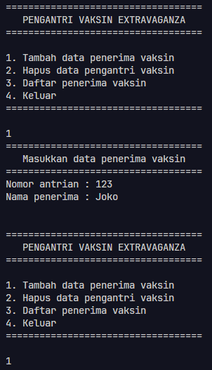

    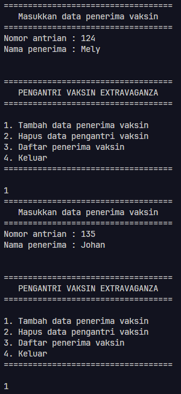

    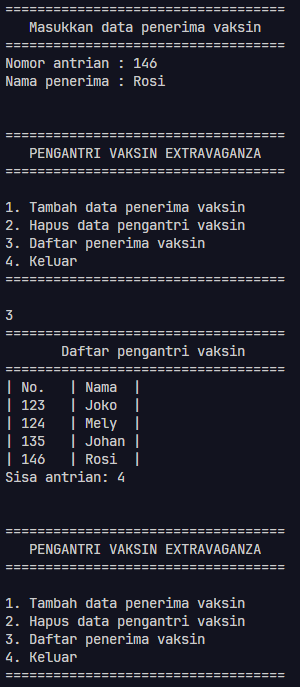

    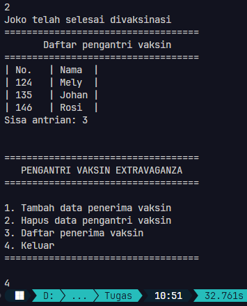

    **Penjelasan:** Di sini saya membuat tiga buah class, yaitu `Antrian`, `Pengantri`, dan `Main`. Class `Pengantri` ini sama seperti sebuah node yang ada pada struktur data double linked list. `Antrian` ini adalah struktur data double linked list-nya. Seluruh mekanisme menambahkan data, menghapus, hingga melihat seluruh data ada di sini. Kemudian yang terakhir adalah class `Main` yang digunakan untuk menjalankan keseluruhan program. 

    Dikarenakan ini adalah struktur data queue berbasis double linked list, maka untuk proses penambahan data sama seperti menambahkan data dari belakang. Di sini saya menggunakan pointer `tail` agar lebih sederhana (tidak perlu looping untuk menentukan node terakhir). Sehingga pointer `head` posisinya tetap hanya `tail` saja yang terus berpindah. Sedangkan pada penghapusan data, maka dilakukan dari depan ke belakang. Dengan demikian posisi dari `head` akan berpindah ke belakang sedangkan pointer `tail` tetap.

2. Buatlah program daftar film yang terdiri dari id, judul dan rating menggunakan double linked 
lists, bentuk program memiliki fitur pencarian melalui ID Film dan pengurutan Rating secara 
descending. Class Film wajib diimplementasikan dalam soal ini.

    Jawab: Untuk kode yang saya buat bisa cek pada link berikut -> [Tugas praktikum 2](tugas_praktikum_2)
    Contoh output: 

    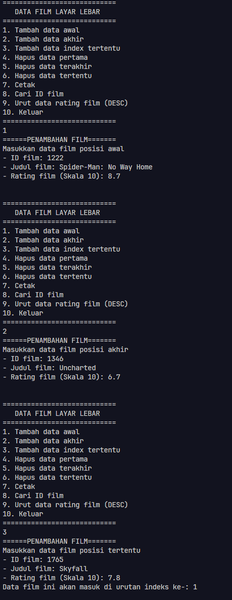

    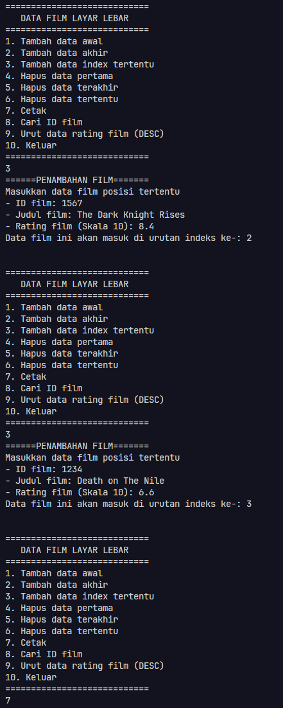

    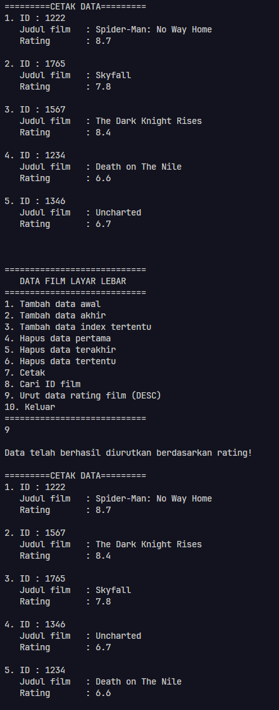

    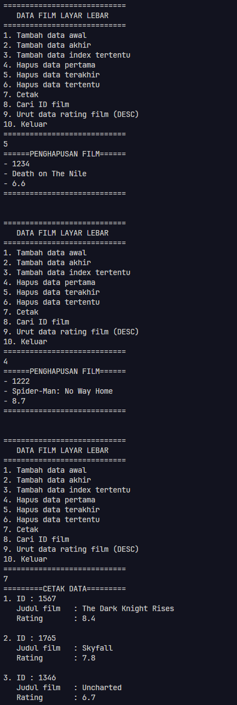

    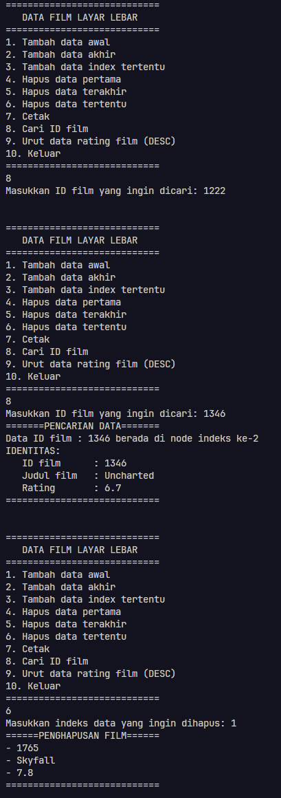

    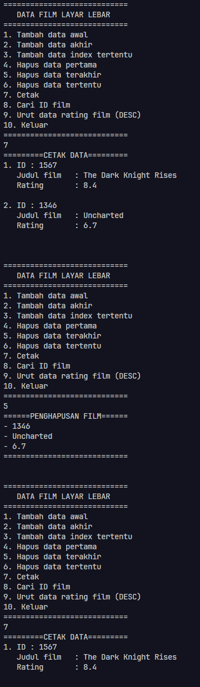

    **Penjelasan:**
    Di sini saya membuat tiga class, yaitu `DaftarFilm`, `Film`, dan `Main`. Class `Film` adalah node. `DaftarFilm` adalah kumpulan data berupa double linked list dan juga segala operasi ada di sini. `Main` digunakan untuk menjalankan keseluruhan program.

    Bentuk operasi yang ada di class `DaftarFilm` adalah operasi standar yang biasa ada di double linked list, seperti penambahan data dari depan, belakang, sesuai indeks, hingga penghapusan. Khusus pada bagian sorting, saya menggunakan algoritma *insertion sort*. Jadi, nanti akan diambil satu data dari bagian tidak terurut kemudian akan dimasukkan ke dalam bagian terurut. Karena ini adalah struktur data double linked list dan saya ingin memiliki pointer `head` dan `tail`, maka setiap dilakukan sorting akan selalu diperbarui nilai pointer tersebut. Untuk proses pembaruan pointer `head` sudah ada bersamaan dengan algoritma *insertion sort*. Sedangkan untuk proses pembaruan pointer `tail` dilakukan setelah proses sorting selesai.