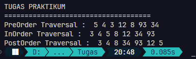
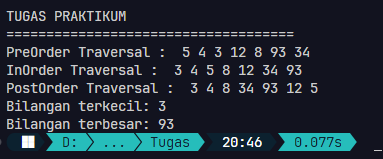
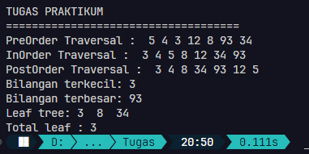
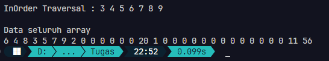
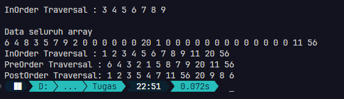

<div align="center">

# Laporan Praktikum Algoritma dan Struktur Data
## Jobsheet 13


\
Nama: Farrel Augusta Dinata

NIM: 2341720081

No. Absen: 12

Kelas: TI-1B

</div>

---
## Percobaan 1
**Implementasi binary search tree menggunakan linked list**

Verifikasi hasil yang didapat:


**Pertanyaan:**
1. Mengapa dalam binary search tree proses pencarian data bisa lebih efektif dilakukan dibanding binary tree biasa?
    
    Jawab: Itu karena pada binary search tree, struktur datanya sudah terurut. Setiap node yang memiliki parent, sudah dipastikan node di kirinya lebih kecil dari parent dan node di sisi kanan nilainya lebih besar dari parent. Karena sudah terurut, maka untuk melakukan pencarian data bisa lebih mudah karena pola datanya sudah kelihatan. Berbeda dengan binary tree biasa yang pola susunan datanya bisa acak. Dengan begitu, kita perlu mengecek satu-satu node hingga ketemu node yang sesuai untuk melakukan pencarian data. Ini jauh lebih memakan waktu daripada binary search tree.

2. Untuk apakah di class `Node`, kegunaan dari atribut `left` dan `right`?

    Jawab: Kedua atribut tersebut digunakan untuk menunjukkan bahwa node tersebut terhubung dengan node lain. Karena ini adalah struktur data pohon/tree, maka nilai dari `left` dan `right` menunjukkan anak dari node/cabang tersebut. Jika sebuah node memiliki nilai atribut `left` dan `right` tidak `null`, maka sudah dipastikan itu adalah parent node. 

3. a. Untuk apakah kegunaan dari atribut `root` di dalam class `BinaryTree`?

    Jawab: Atribut `root` digunakan sebagai titik awal dari seluruh percabangan data yang ada di binary tree. Kalau pada struktur data sebelumnya yang bertipe liniar data structure seperti linked list, atribut `root` mirip dengan atribut `head`. Jika ingin melakukan pencarian data, maka semua itu diawali oleh node `root`. 

    b. Ketika objek tree pertama kali dibuat, apakah nilai dari `root` ?

    Jawab: Ketika baru saja objek tree pertama kali dibuat, maka nilai dari atribut `root` akan bernilai `null`. Alasannya adalah belum ada data yang disimpan pada struktur data tree.

4. Ketika tree masih kosong, dan akan ditambahkan sebuah node baru, proses apa yang akan terjadi?

    Jawab: Proses yang dilakukan pertama kali adalah akan pengecekan apakah tree memang dalam kosong atau tidak. Jika iya, maka data baru tersebut akan dijadikan sebagai `root` dari keseluruhan struktur data tree seterusnya. 

5. Perhatikan method `add()`, di dalamnya terdapat baris program seperti di bawah ini. Jelaskan secara detil untuk apa baris program tersebut?
    ```java
    if (data < current.data) {
        if (current.left != null) {
            current = current.left;
        } else {
            current.left = new Node(data);
            break;
        }
    }
    ```
    Jawab: Kode tersebut awalnya akan memastikan bahwa data baru yang akan dimasukkan nilainya benar-benar lebih kecil dari pointer `current`. Jika data baru yang akan ditambahkan ini memang lebih kecil, maka itu akan siap-siap ditaruh di sisi kiri node. Karena ini adalah data yang baru, maka harus memastikan bahwa di sisi kiri node `current` sudah tidak ada node lagi atau bisa dikatakan atribut `left` dari node `current` bernilai `null`. Itulah fungsi dari blok kode if yang ada di dalam `if (data < current.data)`. 

    Jika sudah berada di node paling akhir yang tidak punya pasangan di sisi kiri, maka langkah selanjutnua adalah melakukan instansiasi objek baru yang isinya data baru yang ingin dimasukkan. 

---
## Percobaan 2
**Implementasi binary tree dengan array**

Verifikasi hasil yang didapat:


**Pertanyaan:**
1. Apakah kegunaan dari atribut `data` dan `idxLast` yang ada di class `BinaryTreeArray`?

    Jawab: Atribut `data` digunakan untuk menyimpan seluruh data yang ada berupa array. Sedangkan `idxLast` digunakan untuk menunjukkan posisi indeks terakhir dari array yang digunakan pada struktur data tree. Itu karena tidak semua data yang ada di array digunakan untuk proses struktur data tree. Atribut `idxLast` bisa berguna lagi saat proses traverse data yang mana itu menggunakan recursive function. Nilai dari `idxLast` bisa digunakan untuk membatasi proses rekursif yang terjadi.

2. Apakah kegunaan dari method `populateData()` ?

    Jawab: Method `populateData()` digunakan untuk menyiapkan data yang digunakan di struktur data tree. Data yang dibutuhkan adalah array yang menampung keseluruhan data dan nilai indeks terakhir untuk mengisi atribut `idxLast`.

3. Apakah kegunaan dari method `traverseInOrder()`?

    Jawab: Method tersebut digunakan untuk mengunjungi data-data yang ada dengan pola seperti ini: `traverse sisi kiri` -> `parent` -> `traverse sisi kanan`. Untuk proses traverse sisi kiri dan kanan dilakukan dengan menggunakan fungsi rekursif `traverseInOrder()`. Sedangkan untuk nilai dari `parent` sesuai dengan nilai parameter `idxStart`. 
    
    Pada kasus ini, struktur data tree disimpan ke dalam array, sehingga penyusunan data agar seperti tree adalah dengan menggunakan pola: nilai parent adalah sesuai indeks *(i)*, nilai *left child* berada di *2i + 1*, nilai *right child* berada di *2i + 2*. Maka dari itu, untuk melakukan traverse sisi kiri argumen yang diisi adalah `2 * idxStart + 1`. Sedangkan untuk traverse ke sisi kanan argumen yang diisi adalah `2 * idxStart + 2`.

4. Jika suatu node binary tree disimpan dalam array indeks 2, maka di indeks berapakah posisi left child dan right child masing-masing?

    Jawab: Pola umum yang digunakan untuk menyimpan data dengan menerapkan konsep tree berbasis array adalah: Anggap saja index sebagai *i*, indeks tersebut digunakan untuk menunjukan data `parent`; data di sebelah kiri ditunjukkan pada posisi *2i + 1*; data di sebelah kanan ditunjukkan pada posisi *2i + 2*. Maka dari itu, jika sebuah data disimpan pada indeks 2, maka posisi left child berada di indeks 5. Sedangkan posisi right child berada di posisi indeks 6.

5. Apa kegunaan statement `int idxLast = 6` pada praktikum 2 percobaan nomor 4?

    Jawab: Statement tersebut digunakan untuk membatasi indeks array yang digunakan. Sebelumnya bisa dilihat jika array `data` memiliki 10 elemen. Tapi dari situ ternyata tidak semuanya dibutuhkan. Hanya sampai data pada indeks ke-6 yang digunakan untuk proses struktur data tree.

---
## Tugas Praktikum
1. Buat method di dalam class `BinaryTree` yang akan menambahkan node dengan cara rekursif!

    Jawab: Kode yang saya buat sebagai berikut:
    ```java
    void addRecursiveWay(Node12 startingNode, int data) {
        if (isEmpty()) {
            root = new Node12(data);
        } else {
            // Node12 current = root
            if (data < startingNode.data) {
                if (startingNode.left != null) {
                    // current = current.left;
                    addRecursiveWay(startingNode.left, data);
                } else {
                    startingNode.left = new Node12(data);
                }
            } else if (data > startingNode.data) {
                if (startingNode.right != null) {
                    // current = current.right;
                    addRecursiveWay(startingNode.right, data);
                } else {
                    startingNode.right = new Node12(data);
                }
            }
        }
    }
    ```
    Contoh output:

    

    Kode tersebut sebenarnya masih mirip dengan kode sebelumnya yaitu menambahkan data dengan metode iterasi. Hal yang paling membedakan adalah dari proses pembaruan node `startingNode` atau `current` pada kode sebelumnya. Jika sebelumnya dilakukan dengan memperbarui node `current` kemudian akan dilakukan proses looping, kali ini saya menggunakan fungsi rekursif untuk memanggil fungsi `addRecursiveWay`. Dengan isi argumen adalah node di sebelah kiri atau kanan dari node saat itu, dan juga data yang ingin ditambahkan. Ini juga membedakan dari sebelumnya yang proses penambahan data dilakukan dari awal node, yaitu `root`. Untuk ini bisa dilakukan dari node manapun.

2. Buat method di dalam class `BinaryTree` untuk menampilkan nilai paling kecil dan yang paling besar yang ada di dalam tree!

    Jawab: Kode yang saya buat sebagai berikut: 
    ```java
    int findSmallestData() {
        int smallestData = root.data;
        Node12 temp = root;
        while (temp != null) {
            if (temp.data < smallestData) {
                smallestData = temp.data;
            }
            temp = temp.left;
        }
        return smallestData;
    }
    ```
    Contoh output:

    

    Kodenya cukup sederhana yaitu akan mencari data terkecil dari node `root` hingga ditemukan data yang paling kecil. Untuk mencari data yang paling kecil, maka yang perlu ditelusuri adalah sisi kiri (atribut `left`). Maka dari itu, saya hanya mencari di sisi kiri node saat itu (`temp = temp.left`). Jika ditemukan data yang paling kecil itu akan ditampung di variabel `smallestData`. Hasil akhir dari proses ini adalah melakukan *return* nilai variabel `smallestData`.

3. Buat method di dalam class `BinaryTree` untuk menampilkan data yang ada di leaf!

    Jawab: Kode yang saya buat seperti ini:
    ```java
    public void showLeaf() {
        System.out.print("\nLeaf tree: ");
        startSearchLeaf(root);
    }

    private static void startSearchLeaf(Node12 current) {
        if (current != null) {
            if (current.left == null && current.right == null) {
                System.out.print(current.data + "  ");
            } else {
                startSearchLeaf(current.left);
                startSearchLeaf(current.right);
            }
        } 
    }
    ```

    Contoh output:

    

    Saya buat dua method dengan tujuan untuk memanajemen kode dengan baik. Saya pisahkan antara method yang digunakan untuk melakukan proses pencarian leaf di main dan method untuk melakukan pencarian secara rekursif. Manfaat lainnya adalah dari class main tidak perlu menambahkan argumen saat melakukan pemanggilan method pencarian leaf. Seluruh proses ini akan selalu di awali dari `root`. Maka dari itu, pada method `startSearchLeaf` yang ada di dalam method `showLeaf` saya isi argumen `root`. 

    Mekanisme pencarian leaf ini adalah dengan melakukan pengecekan apakah node saat ini (`current`) memiliki atribut left dan right bernilai tidak `null`. Jika iya, maka sudah ditemukan leaf dan akan dicetak ke layar. Jika tidak, maka lanjutkan proses traverse/pencarian hingga menjumpai ujung dari struktur data tree yang ditandai dengan tidak dimilikinya node referensi pada atribut `left` dan `right`.

4. Buat method di dalam class `BinaryTree` untuk menampilkan berapa jumlah leaf yang ada di dalam tree!

    Jawab: Ini adalah kode yang saya buat:
    ```java
    public void countLeaf() {
        totalLeaf = 0; // Mereset total leaf
        System.out.print("\nTotal leaf : ");
        startCountLeaf(root);
        System.out.println(totalLeaf);
    }

    private void startCountLeaf(Node12 current) {
        if (current != null) {
            if (current.left == null && current.right == null) {
                totalLeaf++;
            } else {
                startCountLeaf(current.left);
                startCountLeaf(current.right);
            }
        } 
    }
    ```
    Contoh output:

    

    Sebenarnya ini masih mirip dengan kode sebelumnya. Saya juga masih menggunakan metode dua method. Perbedaan di sini adalah penggunaan variabel `totalLeaf` yang digunakan untuk menyimpan jumlah leaf yang ada. Hasil ini didapat dari proses traverse hingga menemukan ujung dari struktur data tree. Jika sebelumnya mekanismenya adalah melakukan pencetakan leaf jika telah ditemukan, maka untuk method yang sekarang saya buat akan menambahkan/increment pada variabel `totalLeaf`. Hasil akhir dari proses ini adalah dengan mencetak variabel `totalLeaf`.


5. Modifikasi class `BinaryTreeArray`, dan tambahkan:
    - Method `add(int data)` untuk memasukkan data ke dalam tree

        Jawab: Saya buat kode berikut:
        ```java
        public void add(int newData) {
            for (int i = 0; i < data.length;) {
                if (data[i] == 0) {
                    data[i] = newData;
                    idxLast = i;
                    break;
                } else if (newData > data[i]) {
                    i = 2 * i + 2;
                    if (i >= data.length) {
                        makeNewArray(i + 1);
                    }
                } else if (newData < data[i]) {
                    i = 2 * i + 1;
                    if (i >= data.length) {
                        makeNewArray(i + 1);
                    }
                }
            }
        }

        private void makeNewArray(int length) {
            int[] oldData = new int[data.length];

            // Menyimpan data lama ke array baru
            for (int i = 0; i < data.length; i++) {
                oldData[i] = data[i];
            }

            // Membuat array dengan lebih panjang
            data = new int[length + 1];
            for (int i = 0; i < oldData.length; i++) {
                data[i] = oldData[i];
            }
        }
        ```

        Contoh output:

        

        Kode pada method `add` adalah kode utama. Di situ dia berperan untuk memposisikan nilai baru ke array yang sudah ada. Penempatan ini berdasarkan pada konsep *binary search tree* yang mana nilai di node left selalu kurang dari node parent dan nilai di node right selalur lebih dari node parent. Karena ini array, maka penempatan data left dan right sesuai pada pola umum, yaitu *2i + 1* jika ganjil dan *2i + 2* jika genap. Maka dari itu, ada kalanya indeks yang akan dimasukkan tersebut melebihi batas dari array yang sudah dibuat. Untuk mengatasi ini saya membuat method `makeNewArray` yang berguna untuk membuat array baru dengan data-data yang dipertahankan dari array sebelumnya. 

        Saya juga menambahkan method `print` untuk membuktikan apakah data yang diinputkan sudah benar-benar tersimpan.
        ```java
        void print() {
            for (int i : data) {
                System.out.print(i + " ");
            }
        }
        ```

    - Method `traversePreOrder()` dan `traversePostOrder()`

        Jawab: Kode yang saya buat sebagai berikut: 
        ```java
        void traversePreOrder(int idxStart) {
            if (idxStart <= idxLast && data[idxStart] != 0) {
                System.out.print(data[idxStart] + " ");
                traverseInOrder(2 * idxStart + 1);
                traverseInOrder(2 * idxStart + 2);
            }
        }

        void traversePostOrder(int idxStart) {
            if (idxStart <= idxLast && data[idxStart] != 0) {
                traverseInOrder(2 * idxStart + 1);
                traverseInOrder(2 * idxStart + 2);
                System.out.print(data[idxStart] + " ");
            }
        }
        ```
        Contoh output:

        
        
        Secara bentuk kode, dua method tersebut tidak berbeda jauh dengan method sebelumnya, yaitu `traverseInOrder`. Secara konsep traverse pre order dilakukan dengan alur : parent -> node kiri -> node kanan. Sedangkan traverse post order dilakukan dengan alur : node kiri -> node kanan -> parent. Untuk melakukan itu semua, hanya perlu d
