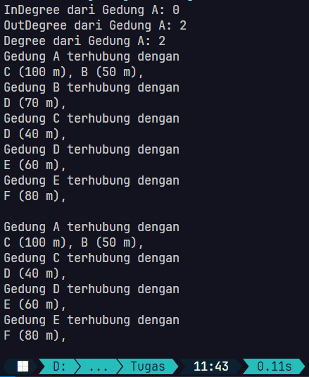
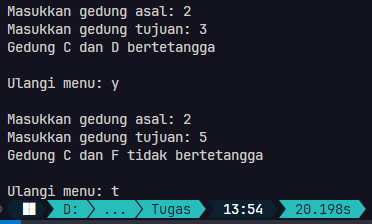
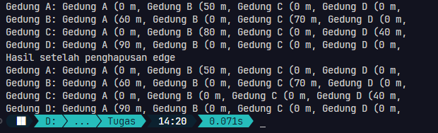
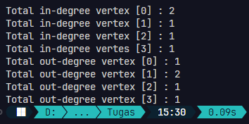
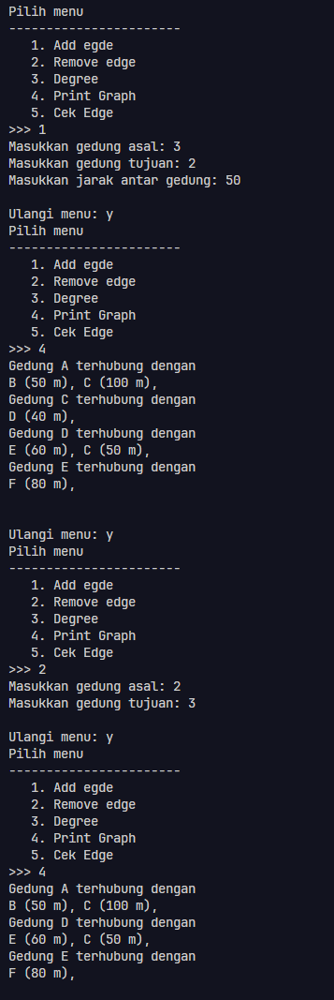
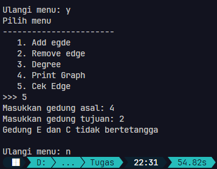
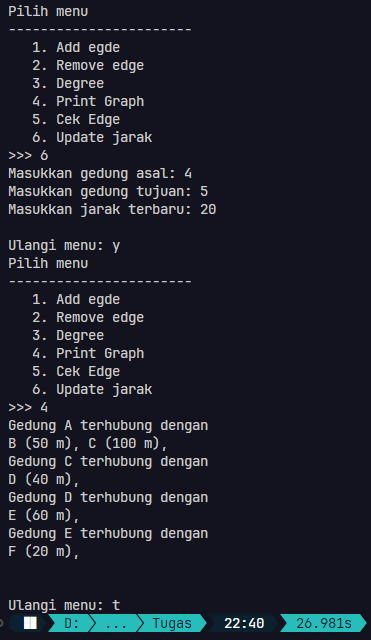

<div align="center">

# Laporan Praktikum Algoritma dan Struktur Data
## Pertemuan 16


\
Nama: Farrel Augusta Dinata

NIM: 2341720081

No. Absen: 12

Kelas: TI-1B

</div>

---
## Percobaan 1
Verifikasi hasil percobaan:



**Pertanyaan:**

1. Perbaiki kode program Anda apabila terdapat error atau hasil kompilasi kode tidak sesuai!

    Jawab: Sudah!

2. Pada class Graph, terdapat atribut `list[]` bertipe `DoubleLinkedList`. Sebutkan tujuan pembuatan variabel tersebut!

    Jawab: Atribut tersebut berfungsi untuk menyimpan pasangan antara node satu dengan banyak node yang lain. Node utama adalah (A, B, C, D, E, F). Masing-masing node tersebut bisa memiliki hubungan antar satu sama lain. Misalnya node A berhubungan dengan C dan D.

3. Jelaskan alur kerja dari method `removeEdge`!

    Jawab: Proses remove edge diawali dengan memberikan argumen kepada fungsi yang dipanggil. Nilai argumen berupa data awal (`asal`) dan juga data pasangannya (`tujuan`). Proses selanjutnya adalah memanggil method `remove` yang dimiliki oleh objek `list`. Penghapusan data ini hanya berlaku pada objek `asal`. Dan juga data yang dihapus hanya sebuah data sesuai dari parameter `tujuan`. 

    Karena method `remove` dimiliki oleh objek `list`, maka langkah selanjutnya akan dilakukan di class `DoubleLinkedList12`. Di dalam method tersebut akan dilakukan pengecekan pada tiap-tiap node yang dimulai dari node `head`. Dari situ akan dicek apakah data yang ada di node `current` sesuai dengan data yang ingin dihapus semula. Pada proses sebelumnya, data ini ditampung pada parameter `tujuan`. Jika datanya sudah sesuai, maka referensi node `current` saat ini akan diputus. Caranya adalah dengan menyambungkan atribut `next` yang ada di node sebelum `current` ke node setelah `current`. Dan juga menyambungkan atribut `prev` yang ada di node setelah node `current` ke node sebelum `current`.

4. Apakah alasan pemanggilan method `addFirst()` untuk menambahkan data, bukan method add jenis lain saat digunakan pada method `addEdge` pada class `Graph`?

    Jawab: Penggunaan method `addFirst` mungkin dirasa ini adalah method yang paling mudah dipahami secara mekanisme. Tapi sebenarnya penggunaan metode pemasukan data dari depan (`addFirst`), dari belakang (`addLast`), ataupun dari indeks tertentu itu tidak terlalu penting bagi struktur data graf. Kunci utama dari graf ini adalah sebuah node yang bisa memiliki hubungan dengan banyak node lain. Hubungan tersebut tidak terlalu mempedulikan urutan node yang disimpan. Karena sebenarnya kedudukan mereka sama saja. 
    
    Misalnya terdapat node 'A'. Node tersebut memiliki hubungan dengan node 'R', 'W', dan 'P'. Dari situ, urutan antara 'R', 'W', dan 'P' tidak begitu penting bagi node 'A'. Jika digambarkan sekalipun menjadi visualisasi graf seesungguhnya, node 'A' bisa langsung ke node lain, 'R', 'W', ataupun 'P'. 

    


5. Modifikasi kode program sehingga dapat dilakukan pengecekan apakah terdapat jalur antara suatu node lainnya, seperti contoh berikut! (Anda dapat memanfaatkan Scanner)!

    ```
    Masukkan gedung asal: 2
    Masukkan gedung tujuan: 3
    Gedung C dan D bertetangga

    Masukkan gedung asal: 2
    Masukkan gedung tujuan: 5
    Gedung C dan F tidak bertetangga
    ```
    Jawab: Hasilnya sebagai berikut:

    

    Di sini saya membuat 2 method baru, yaitu `checkEdge` di class `Graph12` dan juga `checkVertexOwnership` yang ada di class `DoubleLinkedList12`. Selain itu, saya juga menambahkan mekanisme sederhana untuk mengecek apakah dua node saling bertetangga atau tidak di class `GraphMain12` dengan memungkinkan pengguna input data. 

    Program awalnya nanti akan menerima input node awal dan tujuan dari pengguna. Dari situ akan digunakan untuk memanggil method `checkEdge` yang ada di class `Graph12`. Pada method ini tugasnya adalah melakukan pemanggilan method lagi, yaitu `checkVertexOwnership` dan hanya sekedar menampilkan output yang menunjukkan apakah data inputan awal itu adalah saling bertetangga. Alasan saya memanggil method lain yang mana ini dimiliki oleh class `DoubleLinkedList12` adalah data-data yang disimpan di tiap-tiap pasangan/tetangga disimpan melalui class `DoubleLinkedList12`. Jadi, untuk pemrosesan yang berkaitan dengan hal tersebut perlu dilakukan di clas `DoubleLinkedList12`.

    Lanjut ke method `checkVertexOwnership` di class `DoubleLinkedList12`. Di sini akan dilakukan proses pengecekan pada tiap-tiap node apakah memiliki data yang sesuai dengan yang dicari. Untuk memastikan bahwa dua node adalah saling bertetangga adalah memastikan bahwa node tersebut menyimpan referensi node lain. Saya melakukannya dengan mengecek dari node `tail` menuju `head`. Jika data sesuai, maka hasil method ini adalah `true`, jika tidak maka hasil methodnya adalah `false`. Proses terakhir adalah menampilkan status ketertanggaan sesuai dengan hasil method `checkVertexOwnership`.

---
## Percobaan 2
Verifikasi hasil percobaan:



**Pertanyaan:**

1. Perbaiki kode program Anda apabila terdapat error atau hasil kompilasi kode tidak sesuai!

    Jawab: Hanya terdapat kesalahan kecil, yaitu pada method `removeEdge` yang memberikan nilai **-1** untuk menghapus nilai. Jika begitu, data tersebut tidak akan ditampilkan ke terminal. Maka dari itu, saya membuatnya menjadi **0**.
    ```java
    matrix[asal][tujuan] = 0;
    ```
    Kemudian pada method `printGraph` perlu perbaikan kecil untuk mengubah indeks `i` menjadi `j` pada blok kode `if`.

2. Apa jenis graph yang digunakan pada Percobaan 2?

    Jawab: Graf tersebut termasuk ke dalam **adjaceny matrix** yang mana data-datanya disimpan ke dalam sebuah array dua dimensi (V x V). Dengan demikian, tiap-tiap vertex tidak memiliki referensi ke satu sama lain. Meski begitu, masih bisa saling berhubungan dengan melalui nilai yang ada di matriks 2 dimensi.

3. Apa maksud dari dua baris kode berikut?

    ```java
    gdg.makeEdge(1, 2, 70);
    gdg.makeEdge(2, 1, 80);
    ```
    Jawab: Kode tersebut akan menghubungkan antara dua vertex menjadi sebuah satu hubungan dengan jarak tertentu (edge). Argumen awal adalah nilai vertex asal, argumen kedua adalah nilai vertex tujuan, dan argumen ketiga adalah panjang jarak diantara kedua edge. Untuk mekanisme selanjutnya adalah menjalankan method `makeEdge` di class `GraphMatrix12`. Di method tersebut akan memberikan nilai jarak pada indeks `asal` dan `tujuan`.

4. Modifikasi kode program sehingga terdapat method untuk menghitung degree, termassuk `inDegree` dan `outDegree`!

    Jawab: Contoh hasil percobaan yang dihasilkan:
    
    

    Saya membuat dua method baru, yaitu `countInDegree` dan `countOutDegree` pada class `GraphMatrix12`. Mekanisme dari `countInDegree` adalah mengitung data array yang tidak nol pada kolom vertex yang dicari secara vertikal atau baris. Jika ada data yang tidak nol, pada indek array tersebut, maka variabel `result` akan ditambah 1 secara incremental. Kemudian hasilnya akan di return-kan. Untuk mekanisme `countOutDegree` juga mirip. Bedanya proses pencarian berdasarkan kolom dari vertex yang dicari.

---
## Tugas Praktikum
1. Modifikasi kode program pada class `GraphMain` sehingga terdapat menu program yang bersifat dinamis, setidaknya terdiri dari:

    a) Add edge

    b) Remove edge

    c) Degree

    d) Print graph

    e) Cek edge

    Pengguna dapat memilih menu program melalui input Scanner

    Jawab: Pada package percobaan1, saya membuatkan menu tersebut dengan contoh output sebagai berikut:

    

    

    Saya mengemas untuk masing-masing fitur ke dalam method tersendiri di dalam main. Misalnya untuk menambahkan edge, maka bisa memilih menu 1 yang kemudian akan memanggil method `addEdge`. Selain menambahkan method tersebut, saya juga menambahkan mekanisme tambahan agar program bisa bekerja sesuai kemampuan graf menampung datanya. Misalnya pada kode berikut:
    ```java
    if (asal < vertex && tujuan < vertex && asal >= 0 && tujuan >= 0) {
        list[asal].addLast(tujuan, jarak);
    } else {
        System.out.println("Tidak bisa menambahkan edge baru! Gedung tidak ditemukan!!");
    }
    ```

2. Tambahkan method `updateJarak` pada percobaan 1 yang digunakan untuk mengubah jarak antara dua node asal dan tujuan!

    Jawab: Untuk membuat method yang bisa digunakan untuk memperbarui jarak, maka saya membuat dua method baru, yitu `updateJarak` di class `Graph12` dan `updateLength` pada class `DoubleLinkedList12`. 
    ```java
    public void updateJarak(int asal, int tujuan, int newLength) {
        list[asal].updateLength(tujuan, newLength);
    }
    ```
    ```java
    public void updateLength(int tujuan, int newLength) {
        Node12 temp = tail;
        boolean isFind = false;
        while (temp != null) {
            if (temp.data == tujuan) {
                temp.jarak = newLength;
                isFind = true;
            }
            temp = temp.prev;
        }

        if (!isFind) {
            System.out.println("Edge tidak ditemukan! Tidak dapat memperbarui jarak!");
        }
    }
    ```

    Contoh outputnya:

    

    Mekanisme dari kode yang saya buat adalah melakukan pembaruan panjang antara dua vertex yang dilakukan di method `updateJarak`. Dikarenakan vertex asal sebenarnya berbentuk objek dari class `DoubleLinkedList`, maka untuk melakukan pembaruan data perlu dilakukan di dalam class `DoubleLinkedList`. Itulah alasannya saya membuat 2 method baru. 

    Mekanisme dari method `updateLength` yang ada di class `DoubleLinkedList` adalah akan melakukan pencarian dari node `tail` apakah data yang dimiliki pada node tersebut sesuai dengan node/vertex tujuan yang diinputkan pengguna. Jika ditemukan, maka nilai jarak dari node tersebut akan diganti dengan jarak baru dari inputan pengguna. Jika tidak ditemukan, maka akan dicetak pesan berikut: 
    
    ```
    Edge tidak ditemukan! Tidak dapat memperbarui jarak!
    ```

3. Tambahkan method `hitungEdge` untuk menghitung banyaknya edge yang terdapat di dalam graph!

    Jawab: Saya membuat kode perhitungan edge sebagai berikut:
    ```java
    public void hitungEdge() {
        int totalEdge = 0;
        for (int i = 0; i < list.length; i++) {
            Node12 temp = list[i].head;
            while (temp != null) {
                totalEdge++;
                temp = temp.next;
            }
        }
        System.out.println("Total edge: " + totalEdge);
    }
    ```
    Kode tersebut saya buat hanya ada di dalam class `Graph12`. Mekanismenya adalah saya mengecek apakah pada array `list` di indeks `i` tidak `null`, maka `totalEdge` akan selalu bertambah. Awal mulanya adalah sebuah edge itu terbentuk dari dua buah vertex/node. Node pertama disebut node `asal` dan node lain disebut `tujuan`. Node `asal` sebenarnya direpresentasikan dengan array `list` indeks tertentu. Untuk mengetahui pasangannya atau tujuan dari node `asal`, maka bisa dicek dengan node yang tersambung dengan `list[i]`. Itu bisa dicek dari node `head` hingga ke paling akhir (`tail`). Setiap node tersebut akan menambahkan variabel `totalEdge` secara incremental. Proses ini akan berlanjut selama panjang array yang ditampung pada array `list`. Jika proses looping sudah selesai, maka akan langsung dicetak ke layar.