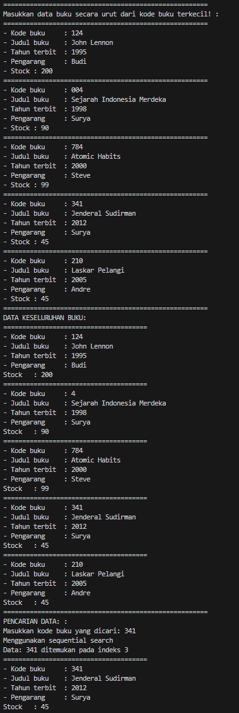

<div align="center">

# Laporan Praktikum Algoritma dan Struktur Data
## Pertemuan 7


\
Nama: Farrel Augusta Dinata

NIM: 2341720081

No. Absen: 12

Kelas: TI-1B

</div>

---
### Percobaan 1 - Pencarian Menggunakan Sequential Search
Hasil percobaan 1.1:
```java
======================================================
Masukkan data buku secara urut dari kode buku terkecil! : 
======================================================
- Kode buku     : 111
- Judul buku    : Algoritma
- Tahun terbit  : 2019
- Pengarang     : Wahyuni
- Stock : 5
======================================================
- Kode buku     : 123
- Judul buku    : Big Data
- Tahun terbit  : 2020
- Pengarang     : Susilo
- Stock : 3
======================================================
- Kode buku     : 125
- Judul buku    : Desain UI
- Tahun terbit  : 2021
- Pengarang     : Supriadi
- Stock : 3
======================================================
- Kode buku     : 126
- Judul buku    : Web Programming 
- Tahun terbit  : 2022
- Pengarang     : Pustaka Adi
- Stock : 2
======================================================
- Kode buku     : 127
- Judul buku    : Etika Mahasiswa
- Tahun terbit  : 2023
- Pengarang     : Darmawan Adi
- Stock : 2
======================================================
DATA KESELURUHAN BUKU:
======================================
- Kode buku     : 111
- Judul buku    : Algoritma
- Tahun terbit  : 2019
- Pengarang     : Wahyuni
Stock   : 5
======================================
- Kode buku     : 123
- Judul buku    : Big Data
- Tahun terbit  : 2020
- Pengarang     : Susilo
Stock   : 3
======================================
- Kode buku     : 125
- Judul buku    : Desain UI
- Tahun terbit  : 2021
- Pengarang     : Supriadi
Stock   : 3
======================================
- Kode buku     : 126
- Judul buku    : Web Programming
- Tahun terbit  : 2022
- Pengarang     : Pustaka Adi
Stock   : 2
======================================
- Kode buku     : 127
- Judul buku    : Etika Mahasiswa
- Tahun terbit  : 2023
- Pengarang     : Darmawan Adi
Stock   : 2
======================================================
PENCARIAN DATA: :
Masukkan kode buku yang dicari: 111
Menggunakan sequential search
Data: 111 ditemukan pada indeks 0
======================================
- Kode buku     : 111
- Judul buku    : Algoritma
- Tahun terbit  : 2019
- Pengarang     : Wahyuni
Stock   : 5
```
Kondisi jika data tidak ditemukan:
```java
======================================================
PENCARIAN DATA: :
Masukkan kode buku yang dicari: 124
Menggunakan sequential search
Data: 124 tidak ditemukan!
Data: 124 tidak ditemukan!
```


**Pertanyaan**
1. Jelaskan fungsi **break** yang ada pada method **findSeqSearch** ?

    Jawab: Untuk menghentikan proses perulangan atau pencarian yang sedang dilakukan. Jadi, misalnya terdapat nilai yang ingin dicari 145, jika ditemukan, maka proses pencariannya akan dihentikan lalu posisi indeks dari nilai yang dicari akan dikembalikan ke fungsi awal yang memanggilnya.
2. Jika data kode buku yang dimasukkan tidak terurut dari kecil ke besar. Apakah program masih dapat berjalan? Apakah hasil yang dikeluarkan benar? Tunjukkan hasil screenshot untuk bukti dengan kode buku yang acak. Jelaskan menagapa hasl tersebut bisa terjadi? 

    Jawab: Meski data acak, program tetap bisa mencari data yang diinginkan. Ini adalah buktinya:

    

    Kenapa bisa begitu? Karena proses pencarian menggunakan sequential search yang mana program akan mengecek satu persatu nilai yang ada dari setiap elemen array. Jadi, meski data yang ada acak, tidak akan berpengaruh pada proses pencarian data. 

3. Buat method baru dengan nama **findBuku** menggunakan konsep sequential search dengan method dari **findBuku** adalah **Buku12**. Sehingga Anda bisa memanggil method tersebut pada class **BukuMain** seperti gambar berikut!
    ```java
    Buku dataBuku = data.findBuku(cari);
    dataBuku.tampilDataBuku();
    ```

    Jawab: Saya buat method baru **findBuku** di class **PencarianBuku12.java**
    ```java
        public Buku12 findBuku(int cari) {
        int posisi = -1;
        for (int i = 0; i < listBk.length; i++) {
            if (listBk[i].kodeBuku == cari) {
                posisi = i;
                break;
            }
        }

        return listBk[posisi];
    }
    ```
    Kemudian pada class **BukuMain** saya tambahkan kode berikut:
    ```java
        System.out.println(
            "=========================================================\n" +
            "Sequential search part 2 (nilai disimpan ke dalam object)"
        );
        Buku12 dataBuku = data.findBuku(cari);
        dataBuku.tampilDataBuku();
    ```
    Ini sebenarnya mirip dengan kode sebelumnya pada method **findSeqSearch** di class **PencarianBuku12**. Bedanya, output dari methodnya adalah object yang ada di class **Buku12**. Kalau sebelumnya hanya mengembalikan posisi elemen nilai yang dicari. Jadi pada cara terbaru akan lebih lengkap.

---
### Percobaan 2 - Pencarian Menggunakan Binary Search
Hasil percobaan
```java
======================================================
PENCARIAN DATA: :
Masukkan kode buku yang dicari: 126
=========================================================
Menggunakan Sequential Search
Data: 126 ditemukan pada indeks 3
======================================
- Kode buku     : 126
- Judul buku    : Web Programming
- Tahun terbit  : 2022
- Pengarang     : Pustaka Adi
Stock   : 2
=========================================================
Sequential search part 2 (nilai disimpan ke dalam object)
======================================
- Kode buku     : 126
- Judul buku    : Web Programming
- Tahun terbit  : 2022
- Pengarang     : Pustaka Adi
Stock   : 2
=========================================================
Menggunakan Binary Search
Data: 126 ditemukan pada indeks 3
======================================
- Kode buku     : 126
- Judul buku    : Web Programming
- Tahun terbit  : 2022
- Pengarang     : Pustaka Adi
Stock   : 2
```

**Pertanyaan**

1. Tunjukkan pada kode program yang mana proses *divide* dijalankan!

    Jawab: Proses divide ada pada baris kode berikut:
    ```java
    } else if (listBk[mid].kodeBuku > cari) {
        return findBinarySearch(cari, left, mid);
    } else {
        return findBinarySearch(cari, mid, right);
    }
    ```
    Pada bagian **findBinarySearch(cari, left, mid)** dan **findBinarySearch(cari, mid, right)** akan membagi barisan kode yang dibutuhkan. Pada pemanggilan findBinarySearch yang atas akan membagi barisan array dari tengah ke kiri. Sedangkan pada pemanggilan findBinarySearch yang bawah akan membagi barisan array dari tengah ke kanan.


2. Tunjukkan pada kode program yang mana proses *conquer* dijalankan!

    Jawab: Untuk algoritma binary search dengan divide and conquer proses terjadinya *conquer* terjadi saat pengecekan apakah nilai tengah sesuai dengan nilai yang dicari. Lebih tepatnya pada kode berikut:
    ```java
    if (cari == listBk[mid].kodeBuku)
    ```

3. Jika Kode Buku yang dimasukkan dari Kode Buku terbesar ke terkecil (misal : 20215, 20214, 20212, 20211, 20210) dan elemen yang dicari adalah 20210. Bagaimana hasil dari binary search? Apakah sesuai? Jika tidak sesuai maka ubahlah kode program binary seach agar hasilnya sesuai!

    Jawab: Hasilnya akan error seperti ini: 
    ```
    Exception in thread "main" java.lang.StackOverflowError
            at P7.PencarianBuku12.findBinarySearch(PencarianBuku12.java:80)
            at P7.PencarianBuku12.findBinarySearch(PencarianBuku12.java:80)
    ```
    Itu berarti terjadi memory stack sudah penuh (sudah saya jelaskan di nomor 4). Penyebabnya adalah pengkondisian yang ada di if else yang memang dirancang mengurutkan data dari terkecil ke terbesar. Selain itu, argumen mid juga salah.

    Berikut adalah hasil modifikasi saya:
    ```java
        public int findBinarySearch(int cari, int left, int right) {
        int mid;
        if (right >= left) {
            mid = (right + left) / 2;
            if (cari == listBk[mid].kodeBuku) {
                return mid;
            } else if (listBk[mid].kodeBuku < cari) {
                return findBinarySearch(cari, left, mid - 1);
            } else {
                return findBinarySearch(cari, mid + 1, right);
            }
        }
        return -1;
    }
    ```
    Hasilnya sebagai berikut:
    ```
    ======================================================
    DATA KESELURUHAN BUKU:
    ======================================
    - Kode buku     : 20215
    - Judul buku    : Algoritma
    - Tahun terbit  : 2019
    - Pengarang     : Wahyuni
    Stock   : 5
    ======================================
    - Kode buku     : 20214
    - Judul buku    : Big Data
    - Tahun terbit  : 2020
    - Pengarang     : Susilo
    Stock   : 3
    ======================================
    - Kode buku     : 20212
    - Judul buku    : Desain UI
    - Tahun terbit  : 2021
    - Pengarang     : Supriadi
    Stock   : 3
    ======================================
    - Kode buku     : 20211
    - Judul buku    : Web Programming
    - Tahun terbit  : 2022
    - Pengarang     : Pustaka Adi
    Stock   : 2
    ======================================
    - Kode buku     : 20210
    - Judul buku    : Etika Mahasiswa
    - Tahun terbit  : 2023
    - Pengarang     : Adi
    Stock   : 2
    ======================================================
    PENCARIAN DATA: :
    Masukkan kode buku yang dicari: 20210
    =========================================================
    Menggunakan Sequential Search
    Data: 20210 ditemukan pada indeks 4
    ======================================
    - Kode buku     : 20210
    - Judul buku    : Etika Mahasiswa
    - Tahun terbit  : 2023
    - Pengarang     : Adi
    Stock   : 2
    =========================================================
    Sequential search part 2 (nilai disimpan ke dalam object)
    ======================================
    - Kode buku     : 20210
    - Judul buku    : Etika Mahasiswa
    - Tahun terbit  : 2023
    - Pengarang     : Adi
    Stock   : 2
    =========================================================
    Menggunakan Binary Search
    Data: 20210 ditemukan pada indeks 4
    ======================================
    - Kode buku     : 20210
    - Judul buku    : Etika Mahasiswa
    - Tahun terbit  : 2023
    - Pengarang     : Adi
    Stock   : 2
    ```

4. Jika data Kode Buku yang dimasukkan tidak urut. Apakah program masih dapat berjalan? Mengapa demikian! Tunjukkan hasil screenshoot untuk bukti dengan kode Buku yang acak. Jelaskan 
Mengapa hal tersebut bisa terjadi? 

    Jawab: Bisa iya bisa tidak. Program akan tetap berjalan jika kebetulan saja nilai yang berada di tengah-tengah array memiliki nilai yang sama dengan nilai yang ingin dicari. Contohnya seperti ini:
    ```java
    ======================================================
    DATA KESELURUHAN BUKU:
    ======================================
    - Kode buku     : 126
    - Judul buku    : Web Programming
    - Tahun terbit  : 2022
    - Pengarang     : Pustaka Adi
    Stock   : 2
    ======================================
    - Kode buku     : 111
    - Judul buku    : Algoritma
    - Tahun terbit  : 2019
    - Pengarang     : Wahyuni
    Stock   : 5
    ======================================
    - Kode buku     : 127
    - Judul buku    : Etika Mahasiswa
    - Tahun terbit  : 2023
    - Pengarang     : Darmawan Adi
    Stock   : 2
    ======================================
    - Kode buku     : 125
    - Judul buku    : Desain UI
    - Tahun terbit  : 2021
    - Pengarang     : Supriadi
    Stock   : 3
    ======================================
    - Kode buku     : 126
    - Judul buku    : Web Programming
    - Tahun terbit  : 2022
    - Pengarang     : Pustaka Adi
    Stock   : 2
    ======================================================
    ```
    Dari data tersebut dicari kode buku 127. Karena nilai tengah dari data tersebut adalah 127, maka hasil dari binary search sudah ditemukan. Dengan demikian tidak terjadi error sama sekali.

    Namun, jika nilai yang berada di tengah array tidak sesuai, maka bisa menimbulkan error berikut:
    ```
    =========================================================
    Menggunakan Binary Search
    Exception in thread "main" java.lang.StackOverflowError
            at P7.PencarianBuku12.findBinarySearch(PencarianBuku12.java:80)
            at P7.PencarianBuku12.findBinarySearch(PencarianBuku12.java:80)
            at P7.PencarianBuku12.findBinarySearch(PencarianBuku12.java:80)
            at P7.PencarianBuku12.findBinarySearch(PencarianBuku12.java:80)
            at P7.PencarianBuku12.findBinarySearch(PencarianBuku12.java:80)
            at P7.PencarianBuku12.findBinarySearch(PencarianBuku12.java:80)
    ```
    (Sebenarnya pesan errornya masih panjang hingga ratusan baris). Terdapat pesan error `Exception in threan "main" java.lang.StackOverflowError`. Itu berarti berkaitan dengan penggunaan memori yang dimiliki. Jadi memori sudah penuh dan tidak bisa melakukan proses lagi sehingga memunculkan pesan error. Ini biasanya  terjadi ketika ada *infinite recursion* atau hal lain yang tidak ada hentinya. Kondisi *infinite recursion* itu bisa terjadi karena pada algoritma binary search tidak bisa mengetahui pola yang nilai yang ada. 

    Contoh dari kasus tersebut adalah seperti ini: Ada input dengan urutan kode buku sebagai berikut [126, 111, 127, 125, 126]. Dari urutan data tersebut, anggap saja cari data dengan kode buku 125. Secara umum akan menentukan nilai tengah terlebih dahulu yaitu pada indeks 2, 127. Saat dibandingkan dengann nilai yang ingin dicari ternyata hasilnya lebih dari 125. Program akan menganggap posisi 125 berada di samping kiri dari nilai tengah tersebut. Maka dari itu, proses selanjutnya akan melakukan rekursi ini **findBinarySearch(125, 0, 2)** (2 diambil dari nilai tengah). 

    Proses selanjutnya adalah menentukan nilai tengah yang berada pada indeks ke-1, yaitu 111. Dibandingkan lagi 111 dengan 125. Hasilnya adalah 111 kurang dari 125. Lalu proses rekursi lagi **findBinarySearch(125, 1, 2)** (1 didapat dari nilai tengah). Menentukan nilai tengah lagi hasilnya 1, yaitu 111. Masih belum sesuai, jadi melakukan proses rekursi **findBinarySearch(125, 1, 2)** (1 didapat dari nilai tengah). Proses ini sama seperti sebelumnya berarti akan terjadi perulangan tiada henti. Maka dari itu, terjadi pesan error `Exception in threan "main" java.lang.StackOverflowError`. 

---
### Percobaan 3 - Percobaan Pengayaan Divide and Conquer
Hasil percobaan:
```
Sorting dengan merge sort: 
Data awal: 
10 40 30 50 70 20 100 90 
Setelah diurutkan: 
10 20 30 40 50 70 90 100 
```
Lebih lengkapnya pada link berikut [klik aku](TestSearching/src%20[MY%20CODES%20ARE%20HERE]/P5/)

---
### Latihan Praktikum
1. Modifikasi percobaan searching di atas dengan ketentuan berikut ini:
    - Ubah tipe data dari kode Buku yang awalnya int menjadi String
    - Tambahkan method untuk pencarian kode Buku (bertipe data String) dengan menggunakan sequential search dan binary search!

    Jawab: 
    - Mengubah tipe data kodeBuku dari integer menjadi String akan mempengaruhi bagian-bagian berikut:

        Pada class Buku, kode Buku yang menjadi atribut pada class Buku12 berubah menjadi String. Selain itu, parameter konstruktor juga akan berubah menjadi String.
        ```java
        package P7;

        public class Buku12 {
            int tahunTerbit, stock;
            String judulBuku, pengarang, kodeBuku;

            Buku12(String kodeBuku, String judulBuku, int tahunTerbit, String pengarang, int stock) {
                this.kodeBuku = kodeBuku;
                this.judulBuku = judulBuku;
                this.tahunTerbit = tahunTerbit;
                this.pengarang = pengarang;
                this.stock = stock;
            }

            // other codes
        }
        ```

        Perubahan proses pencarian kodeBuku pada method findSeqSearch, findBuku, findBinarySearch, tampilPosisi, dan tampilData.
        ```java
        public int findSeqSearch(String cari) { // sebelumnya: int cari
            int posisi = -1;
            for (int i = 0; i < listBk.length; i++) {
                if (listBk[i].kodeBuku.equals(cari)) { // sebelumnya: listBk[i] == cari
                    posisi = i;
                    break;
                }
            }

            return posisi;
        }

        // Searching dengan metode sequential dan return value bertipe objek
        public Buku12 findBuku(String cari) { // sebelumnya: int cari
            int posisi = -1;
            for (int i = 0; i < listBk.length; i++) {
                if (listBk[i].kodeBuku.equals(cari)) { // sebelumnya: listBk[i] == cari
                    posisi = i;
                    break;
                }
            }

            return listBk[posisi];
        }

        public int findBinarySearch(String cari, int left, int right) {
            int mid;
            if (right >= left) {
                mid = (right + left) / 2;
                if (cari.equals(listBk[mid].kodeBuku)) {
                    return mid;
                } else {
                    int posisiKiri = findBinarySearch(cari, left, mid - 1);
                    int posisiKanan = findBinarySearch(cari, mid + 1, right);
                    if (posisiKanan != -1) {
                        return posisiKanan;
                    } else if (posisiKiri != -1) {
                        return posisiKiri;
                    }
                }
            }
            return -1;
        }

        public void tampilPosisi(String x, int pos) { // sebelumnya: int x, int pos
            if (pos != -1) {
                System.out.println("Data: "+ x +" ditemukan pada indeks "+ pos);
            } else {
                System.out.println("Data: "+ x + " tidak ditemukan!");
            }
        }

        public void tampilData(String x, int pos) { // sebelumnya: int x, int pos
            if (pos != -1) {
                System.out.println(
                    "======================================\n" +
                    "- Kode buku\t: " + x +
                    "\n- Judul buku\t: " + listBk[pos].judulBuku + 
                    "\n- Tahun terbit\t: " + listBk[pos].tahunTerbit +
                    "\n- Pengarang\t: " + listBk[pos].pengarang +
                    "\nStock\t: " + listBk[pos].stock
                );
            } else {
                System.out.println("Data: "+ x + " tidak ditemukan!");
            }
        }
        ```
        Untuk method **tampilPosisi** dan **tampilData** yang berubah hanyalah parameter x yang menjadi String.

        Pada class **BukuMain12**, yang berubah hanyalah input **kodeBuku** dan input kode yang ingin dicari.
        ```java
        System.out.print(
            "======================================================\n" +
            "- Kode buku\t: "
        );
        String kodeBuku = sc1.nextLine();

        ////

        System.out.print(
            "======================================================\n" +
            "PENCARIAN DATA: : \n" +
            "Masukkan kode buku yang dicari: "
        );
        String cari = sc1.nextLine();
        ```

    - Modifikasi method untuk pencarian kode buku (bertipe String) dengan sequential dan binary search
    
        Untuk sequential search, kode yang saya buat sebagai berikut:
        ```java
        public int findSeqSearch(String cari) { // sebelumnya: int cari
            int posisi = -1;
            for (int i = 0; i < listBk.length; i++) {
                if (listBk[i].kodeBuku.equals(cari)) { // sebelumnya: listBk[i] == cari
                    posisi = i;
                    break;
                }
            }

            return posisi;
        }

        // Searching dengan metode sequential dan return value bertipe objek
        public Buku12 findBuku(String cari) { // sebelumnya: int cari
            int posisi = -1;
            for (int i = 0; i < listBk.length; i++) {
                if (listBk[i].kodeBuku.equals(cari)) { // sebelumnya: listBk[i] == cari
                    posisi = i;
                    break;
                }
            }

            return listBk[posisi];
        }
        ```
        Tidak banyak yang berubah dari metode pencarian dengan sequential search karena memang mekanisme mengecek satu persatu elemen, jadi tipe data jenis apapun masih mungkin untuk dilakukan dengan cara yang lama.

        Khusus untuk binary search, mekanismenya agak berbeda. Jika nilai kode buku bertipe integer, kita bisa membandingkan (lebih besar atau lebih kecil) nilai kode buku dengan nilai yang berada di tengah array. Kemudian bisa tahu kira-kira posisinya berada di sisi kanan atau kiri array. Namun, karena sekarang kode buku sudah berbentuk string, jadinya tidak bisa membandingkan lebih besar atau lebih kecil. Maka dari itu, proses pencariannya dilakukan dengan mencari di seluruh sisi. Implementasinya ke dalam bentuk kodenya sebagai berikut:
        ```java
        public int findBinarySearch(String cari, int left, int right) {
            int mid;
            if (right >= left) {
                mid = (right + left) / 2;
                if (cari.equals(listBk[mid].kodeBuku)) {
                    return mid;
                } else {
                    int posisiKiri = findBinarySearch(cari, left, mid - 1);
                    int posisiKanan = findBinarySearch(cari, mid + 1, right);
                    if (posisiKanan != -1) {
                        return posisiKanan;
                    } else if (posisiKiri != -1) {
                        return posisiKiri;
                    }
                }
            }
            return -1;
        }
        ```
        Di bagian kode berikut:
        ```java
            int posisiKiri = findBinarySearch(cari, left, mid - 1);
            int posisiKanan = findBinarySearch(cari, mid + 1, right);
            if (posisiKanan != -1) {
                return posisiKanan;
            } else if (posisiKiri != -1) {
                return posisiKiri;
            }
        ```
        Saya membuat agar program melakukan proses divide di menjadi sisi kiri dan sisi kanan. Jika dari salah satu sisi nilai posisinya tidak **-1**, maka posisi dari nilai yang ingin dicari berada di sisi tersebut.

        Berikut adalah contoh output yang dihasilkan:
        ```
        ======================================================
        Masukkan data buku secara urut dari kode buku terkecil! :
        ======================================================
        - Kode buku     : AA123
        - Judul buku    : Berjuang
        - Tahun terbit  : 2019
        - Pengarang     : Gunawan
        - Stock         : 90
        ======================================================
        - Kode buku     : MNQW2
        - Judul buku    : Sisi Lain
        - Tahun terbit  : 2000
        - Pengarang     : Jaya
        - Stock         : 12
        ======================================================
        - Kode buku     : POP345
        - Judul buku    : Pahlawanku
        - Tahun terbit  : 1980
        - Pengarang     : Junaedi
        - Stock         : 340
        ======================================================
        - Kode buku     : JJAK9
        - Judul buku    : Dunia Itu Indah
        - Tahun terbit  : 2019
        - Pengarang     : Alex
        - Stock         : 80
        ======================================================
        - Kode buku     : IQW3
        - Judul buku    : Sang Senja
        - Tahun terbit  : 2017
        - Pengarang     : Bagus
        - Stock         : 90
        ======================================================
        DATA KESELURUHAN BUKU:
        ======================================
        - Kode buku     : AA123
        - Judul buku    : Berjuang
        - Tahun terbit  : 2019
        - Pengarang     : Gunawan
        Stock   : 90
        ======================================
        - Kode buku     : MNQW2
        - Judul buku    : Sisi Lain
        - Tahun terbit  : 2000
        - Pengarang     : Jaya
        Stock   : 12
        ======================================
        - Kode buku     : POP345
        - Judul buku    : Pahlawanku
        - Tahun terbit  : 1980
        - Pengarang     : Junaedi
        Stock   : 340
        ======================================
        - Kode buku     : JJAK9
        - Judul buku    : Dunia Itu Indah
        - Tahun terbit  : 2019
        - Pengarang     : Alex
        Stock   : 80
        ======================================
        - Kode buku     : IQW3
        - Judul buku    : Sang Senja
        - Tahun terbit  : 2017
        - Pengarang     : Bagus
        Stock   : 90
        ======================================================
        PENCARIAN DATA: :
        Masukkan kode buku yang dicari: JJAK9
        =========================================================
        Menggunakan Sequential Search
        Data: JJAK9 ditemukan pada indeks 3
        ======================================
        - Kode buku     : JJAK9
        - Judul buku    : Dunia Itu Indah
        - Tahun terbit  : 2019
        - Pengarang     : Alex
        Stock   : 80
        =========================================================
        Sequential search part 2 (nilai disimpan ke dalam object)
        ======================================
        - Kode buku     : JJAK9
        - Judul buku    : Dunia Itu Indah
        - Tahun terbit  : 2019
        - Pengarang     : Alex
        Stock   : 80
        =========================================================
        Menggunakan Binary Search
        Data: JJAK9 ditemukan pada indeks 3
        ======================================
        - Kode buku     : JJAK9
        - Judul buku    : Dunia Itu Indah
        - Tahun terbit  : 2019
        - Pengarang     : Alex
        Stock   : 80
        ```

2. Modifikasi percobaan searching di atas dengan ketentuan berikut ini!
    - Tambahkan method pencarian judul buku menggunakan sequential search dan binary search. Sebelum dilakukan searching dengan binary search data harus dilakukan pengurutan dengan menggunakan algoritma Sorting (bebas pilih algoritma sorting apapun)! Sehingga ketika input data acak, maka algoritma searching akan tetap berjalan.
    - Buat aturan untuk mendeteksi hasil pencarian judul buku yang lebih dari 1 hasil dalam bentuk kalimat peringatan! Pastikan algoritma yang diterapkan sesuai dengan kasus yang diberikan!

    Jawab: 
    - Menambahkan method pencarian judul buku

        Saya menggunakan method yang sama seperti sebelumnya karena mekanisme prosesnya sama dan hanya dibedakan nilai yang dicari. Pada class **BukuMain**, saya menambahkan opsi switch case seperti ini:
        ```java
        System.out.print(
            "======================================================\n" +
            "PILIH OPSI PENCARIAN BUKU: \n" +
            "   1. Kode buku\n" +
            "   2. Judul buku\n" +
            ">>> "
        );
        int pilihanPencarian = sc1.nextInt();
        sc1.nextLine();

        switch (pilihanPencarian) {
            case 1:
                cariBuku(data, "kode");
                break;
            case 2:
                cariBuku(data, "judul");
                break;
            default:
                invalidInput();
                break;
        }
        ```

        Untuk pencarian data buku, saya buat method **cariBuku** yang bisa mencari data buku berdasarkan *kode* ataupun *judul*.
        ```java
        private static void cariBuku(PencarianBuku12 data, String jenis) {
        String cari;
            if (jenis.equals("kode")) {
                System.out.print(
                    "======================================================\n" +
                    "PENCARIAN DATA: : \n" +
                    "Masukkan kode buku yang dicari: "
                );
                cari = sc1.nextLine();

                System.out.println(
                    "=========================================================\n" +
                    "Menggunakan Sequential Search"
                );
                int posisi = data.findSeqSearch(cari);
                data.tampilPosisi(cari, posisi);
                data.tampilData(cari, posisi);
            
                System.out.println(
                    "=========================================================\n" +
                    "Sequential search part 2 (nilai disimpan ke dalam object)"
                );
                Buku12 dataBuku = data.findBuku(cari);
                dataBuku.tampilDataBuku();

                System.out.println(
                    "=========================================================\n" +
                    "Menggunakan Binary Search "
                );
                posisi = data.findBinarySearch(cari, 0, jmlBuku - 1);
                data.tampilPosisi(cari, posisi);
                data.tampilData(cari, posisi);
            } else {
                System.out.print(
                    "======================================================\n" +
                    "PENCARIAN DATA: : \n" +
                    "Masukkan judul buku yang dicari: "
                );
                cari = sc1.nextLine();

                System.out.println(
                    "=========================================================\n" +
                    "Sequential search"
                );
                Buku12 dataBuku = data.findJudulBuku(cari);
                dataBuku.tampilDataBuku();

                System.out.println(
                    "=========================================================\n" +
                    "Menggunakan Binary Search "
                );
                int posisi = data.findBinarySearchJudulBuku(cari, 0, jmlBuku - 1);
                data.tampilPosisi(cari, posisi);
                data.tampilData(cari, posisi);
            }
        }
        ```

        Di class **PencarianBuku**, saya menambahkan dua method baru **findBinarySearchJudulBuku** dan **findJudulBuku**yang berfungsi mencari data buku berdasarkan judul buku.Selain itu, saya menggunakan algoritma insertion sort untuk proses sorting sebelum proses binary search dilakukan.
        ```java
        public Buku12 findJudulBuku(String cari) {
            int posisi = -1;
            for (int i = 0; i < listBk.length; i++) {
                if (listBk[i].judulBuku.equalsIgnoreCase(cari)) {
                    posisi = i;
                    break;
                }
            }

            return listBk[posisi];
        }

        public int findBinarySearchJudulBuku(String cari, int left, int right) {
            insertionSort();
            System.out.println("Data yang telah terurut: ");
            tampil();

            int mid;
            if (right >= left) {
                mid = (right + left) / 2;
                if (cari.equalsIgnoreCase(listBk[mid].judulBuku)) {
                    return mid;
                } else {
                    int posisiKiri = findBinarySearchJudulBuku(cari, left, mid - 1);
                    int posisiKanan = findBinarySearchJudulBuku(cari, mid + 1, right);
                    if (posisiKanan != -1) {
                        return posisiKanan;
                    } else if (posisiKiri != -1) {
                        return posisiKiri;
                    }
                }
            }
            return -1;
        }

        private void insertionSort() {
            // ASCENDING SORT
            for (int i = 1; i < listBk.length; i++) {
                Buku12 temp = listBk[i];
                int j = i;
                while (j > 0 && listBk[j - 1].judulBuku.compareToIgnoreCase(temp.judulBuku) > 0) {
                    listBk[j] = listBk[j - 1];
                    j--;
                }
                listBk[j] = temp;
            }
        }
        ```

        Contoh output yang dihasilkan:
        ```
        ======================================================
        Masukkan data buku secara urut dari kode buku terkecil! : 
        ======================================================
        - Kode buku     : SKJN
        - Judul buku    : Algoritma
        - Tahun terbit  : 2019
        - Pengarang     : Wahyuni
        - Stock         : 7
        ======================================================
        - Kode buku     : SDVN
        - Judul buku    : Big Data
        - Tahun terbit  : 2020
        - Pengarang     : Susilo
        - Stock         : 90
        ======================================================
        - Kode buku     : JSKD 
        - Judul buku    : Desain UI
        - Tahun terbit  : 2021
        - Pengarang     : Supriadi
        - Stock         : 6
        ======================================================
        - Kode buku     : SCNK
        - Judul buku    : Web Programming
        - Tahun terbit  : 2022
        - Pengarang     : Pustaka Adi
        - Stock         : 3
        ======================================================
        - Kode buku     : KSNDV
        - Judul buku    : Etika Mahasiswa
        - Tahun terbit  : 2023
        - Pengarang     : Darmawan Adi
        - Stock         : 7
        ======================================================
        DATA KESELURUHAN BUKU:
        ======================================
        - Kode buku     : SKJN
        - Judul buku    : Algoritma
        - Tahun terbit  : 2019
        - Pengarang     : Wahyuni
        Stock   : 7
        ======================================
        - Kode buku     : SDVN
        - Judul buku    : Big Data
        - Tahun terbit  : 2020
        - Pengarang     : Susilo
        Stock   : 90
        ======================================
        - Kode buku     : JSKD
        - Judul buku    : Desain UI
        - Tahun terbit  : 2021
        - Pengarang     : Supriadi
        Stock   : 6
        ======================================
        - Kode buku     : SCNK
        - Judul buku    : Web Programming
        - Tahun terbit  : 2022
        - Pengarang     : Pustaka Adi
        Stock   : 3
        ======================================
        - Kode buku     : KSNDV
        - Judul buku    : Etika Mahasiswa
        - Tahun terbit  : 2023
        - Pengarang     : Darmawan Adi
        Stock   : 7
        ======================================================
        PILIH OPSI PENCARIAN BUKU:
        1. Kode buku
        2. Judul buku
        >>> 2
        ======================================================
        PENCARIAN DATA: :
        Masukkan judul buku yang dicari: Etika Mahasiswa
        =========================================================
        Sequential search
        ======================================
        - Kode buku     : KSNDV
        - Judul buku    : Etika Mahasiswa
        - Tahun terbit  : 2023
        - Pengarang     : Darmawan Adi
        Stock   : 7
        =========================================================
        Menggunakan Binary Search
        Data: Etika Mahasiswa ditemukan pada indeks 3
        ======================================
        - Kode buku     : KSNDV
        - Judul buku    : Etika Mahasiswa
        - Tahun terbit  : 2023
        - Pengarang     : Darmawan Adi
        Stock   : 7
        ```

    - Menambahkan aturan untuk mendeteksi hasil pencarian judul buku yang lebih dari 1 hasil dalam bentuk kalimat peringatan.

        Saya melakukannya dengan memodifikasi method **findJudulBuku** dan menambahkan method baru untuk menampilkan pesan bahwa terdapat lebih dari satu data buku yang memiliki judul yang sama.
        ```java
        public Buku12 findJudulBuku(String cari) {
            int posisi = -1;
            int jumlahBukuDitemukan = 0;
            for (int i = 0; i < listBk.length; i++) {
                if (listBk[i].judulBuku.equalsIgnoreCase(cari)) {
                    posisi = i;
                    jumlahBukuDitemukan++;
                }
            }

            if (jumlahBukuDitemukan > 1) {
                tampilDitemukanJudulSama();
            }

            return listBk[posisi];
        }

        private static void tampilDitemukanJudulSama() {
            System.out.println("TERDAPAT LEBIH DARI 1 BUKU DENGAN JUDUL SAMA");
        }
        ```
        Mekanisme dari modifikasi saya pada method **findJudulBuku** tersebut adalah akan menambahkan nilai ke **jumlahBukuDitemukan** jika terdapat data yang sesuai dengan yang dicari. Jika nilai dari **jumlahBukuDitemukan** lebih dari 1, berarti hasil pencarian mendapati data dengan judul yang sama. 

        Selain itu, method **findBinarySearchJudulBuku** saya juga melakukan sedikit perubahan:
        ```java
        // Modifikasi binary search sehingga bisa memunculkan peringatan terdapat duplikasi data
        public int findBinarySearchJudulBuku(String cari, int left, int right) {
            insertionSort();

            int mid;
            if (right >= left) {
                mid = (right + left) / 2;
                if (cari.equalsIgnoreCase(listBk[mid].judulBuku)) {
                    // Cari data lain lain yang mungkin sama
                    int posisiKiri = findBinarySearchJudulBuku(cari, left, mid - 1);
                    int posisiKanan = findBinarySearchJudulBuku(cari, mid + 1, right);

                    // Jika nilai 'posisiKanan' atau 'posisiKiri' tidak -1, berarti ada data lain yang ditemukan di indeks tertentu
                    // Maka dari itu, kode di bawah ini yang menyatakan adanya duplikasi data
                    if (posisiKanan != -1 || posisiKiri != -1) {
                        tampilDitemukanJudulSama();
                    }
                    return mid;
                } else {
                    int posisiKiri = findBinarySearchJudulBuku(cari, left, mid - 1);
                    int posisiKanan = findBinarySearchJudulBuku(cari, mid + 1, right);

                    if (posisiKanan != -1) {
                        return posisiKanan;
                    } else if (posisiKiri != -1) {
                        return posisiKiri;
                    }
                }
            }
            return -1;
        }
        ```
        Mekanismenya adalah, ketika sudah menemukan data yang sesuai dengan yang dicari, maka tidak akan langsung *return* terlebih dahulu. Program akan mengecek apakah hanya data ini saja yang sesuai dengan data yang ingin dicari pengguna (Caranya masih sama dengan rekursif function). Jika sebelumnya saya menggunakan proses incremental variable ketika terdapat data yang sesuai dicari, pada binary search kali ini saya menggunakan pengecekan nilai dari hasil **posisiKiri** dan **posisiKanan**. Secara default, jika tidak ditemukan data yang sesuai maka nilai dari **posisiKiri** atau **posisiKanan** adalah -1. Tapi jika data ditemukan, maka akan mengembalikan data sesuai indeks data yang ditemukan. Dengan demikian memenuhi syarat kondisi yang ada pada kode berikut:
        ```java
        if (posisiKanan != -1) {
            return posisiKanan;
        } else if (posisiKiri != -1) {
            return posisiKiri;
        }
        ```
        Akhirnya program akan memberikan peringatan bahwa terdapat data yang duplikat.

        Untuk output yang ditampilkan akan seperti ini:
        ```
        ======================================================
        Masukkan data buku secara urut dari kode buku terkecil! : 
        ======================================================
        - Kode buku     : ASM
        - Judul buku    : Algoritma
        - Tahun terbit  : 2019
        - Pengarang     : Wahyudi
        - Stock         : 90
        ======================================================
        - Kode buku     : AKMS
        - Judul buku    : Algoritma
        - Tahun terbit  : 2020
        - Pengarang     : Dono
        - Stock         : 19
        ======================================================
        - Kode buku     : ASKM
        - Judul buku    : Big Data
        - Tahun terbit  : 1980
        - Pengarang     : Kasino
        - Stock         : 29
        ======================================================
        - Kode buku     : SJCN
        - Judul buku    : Desain UI
        - Tahun terbit  : 2020
        - Pengarang     : Indro
        - Stock         : 20
        ======================================================
        - Kode buku     : ASKJ
        - Judul buku    : Rekayasa Perangkat Lunak
        - Tahun terbit  : 2018
        - Pengarang     : John Doe
        - Stock         : 23
        ======================================================
        DATA KESELURUHAN BUKU:
        ======================================
        - Kode buku     : ASM
        - Judul buku    : Algoritma
        - Tahun terbit  : 2019
        - Pengarang     : Wahyudi
        Stock   : 90
        ======================================
        - Kode buku     : AKMS
        - Judul buku    : Algoritma
        - Tahun terbit  : 2020
        - Pengarang     : Dono
        Stock   : 19
        ======================================
        - Kode buku     : ASKM
        - Judul buku    : Big Data
        - Tahun terbit  : 1980
        - Pengarang     : Kasino
        Stock   : 29
        ======================================
        - Kode buku     : SJCN
        - Judul buku    : Desain UI
        - Tahun terbit  : 2020
        - Pengarang     : Indro
        Stock   : 20
        ======================================
        - Kode buku     : ASKJ
        - Judul buku    : Rekayasa Perangkat Lunak
        - Tahun terbit  : 2018
        - Pengarang     : John Doe
        Stock   : 23
        ======================================================
        PILIH OPSI PENCARIAN BUKU:
        1. Kode buku
        2. Judul buku
        >>> 2
        ======================================================
        PENCARIAN DATA: :
        Masukkan judul buku yang dicari: Algoritma
        =========================================================
        Sequential search
        TERDAPAT LEBIH DARI 1 BUKU DENGAN JUDUL SAMA
        ======================================
        - Kode buku     : AKMS
        - Judul buku    : Algoritma
        - Tahun terbit  : 2020
        - Pengarang     : Dono
        Stock   : 19
        =========================================================
        Menggunakan Binary Search
        TERDAPAT LEBIH DARI 1 BUKU DENGAN JUDUL SAMA
        Data: Algoritma ditemukan pada indeks 0
        ======================================
        - Kode buku     : ASM
        - Judul buku    : Algoritma
        - Tahun terbit  : 2019
        - Pengarang     : Wahyudi
        Stock   : 90
        ```