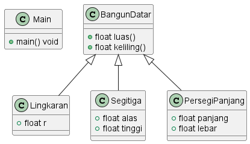

> Package Java Project ini berisi soal latihan pada minggu ke 7 mata kuliah Pemrograman Berbasis Objek/Object Oriented Programming. 

> Implementsai kode program ini berdasarkan pada class diagram berikut



# Penjelasan
- `instanceof`

    Kata kunci `instanceof` berfungsi untuk mengecek apakah suatu objek dihasilkan atau diinstansiasi dari class tertentu.
    Contoh kode:
    ```java
    if (this instanceof PersegiPanjang)
    ```
    Kata `this` merujuk pada objek yang memanggil method `luas()` atau `keliling()` yang ada di parent (`BangunDatar.java`). Jadi misalkan terdapat kode berikut:
    ```java
    PersegiPanjang pp = new PersegiPanjang();
    System.out.println(pp.luas());
    ```
    Objek `pp` dihasilkan dari class `PersegiPanjang`. Kemudian dia memanggil method luas: `pp.luas()`. Berdasarkan kode sebelumnya bisa dilihat bahwa objek `pp` adalah hasil instansiasi dari class `PersegiPanjang`. Maka dari itu, kondisi if di atas bernilai `true` dan akan mengeksekusi kode di dalamnya. Ini berlaku juga pada objek yang diinstansiasi oleh objek lain.
- `getClass()` dan `class` atribute

    Konsep dari `getClass()` dan atribute `class` mirip dengan sebelumnya. Untuk cara kerjanya `getClass()` akan mendapatkan nama class dari objek yang telah dibuat. Objek yang dimaksud adalah objek bernama `this`. 
    Jadi, nanti akan dicocokkan antara nama class dari objek `this` dengan nama class dari beberapa class lain yang sudah dibuat (`PersegiPanjang.java`, `Lingkaran.java`, `Segitiga.java`). Jika sesuai, maka rumus yang digunakan adalah sesuai yang ada di blok if