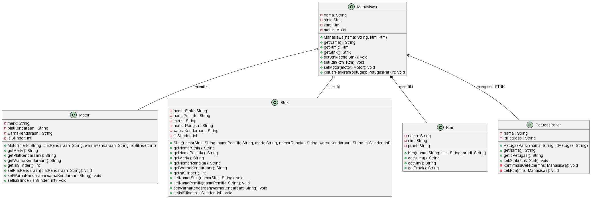
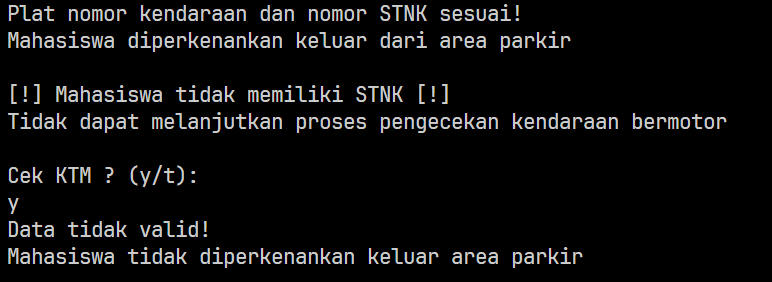

# Soal

Berdasarkan latihan di pertemuan teori (asosiasi, agregasi, dan dependensi), rancang dengan class diagram, kemudian implementasikan
ke dalam program! Studi kasus harus mewakili relasi class dari percobaan‑percobaan yang telah
dilakukan pada materi ini, setidaknya melibatkan minimal 4 class (class yang berisi main tidak
dihitung).

Jawab: Hasil rancangan class diagram:

