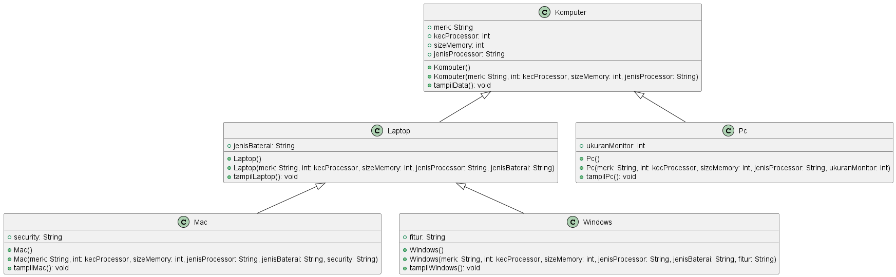
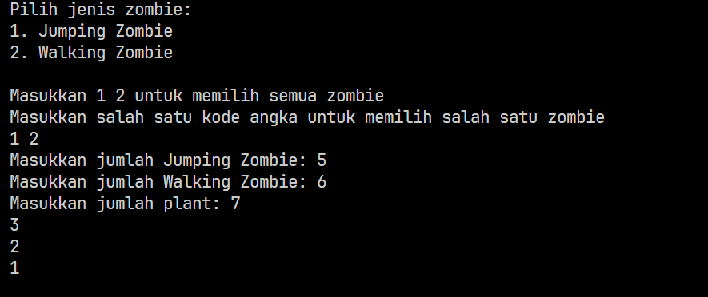
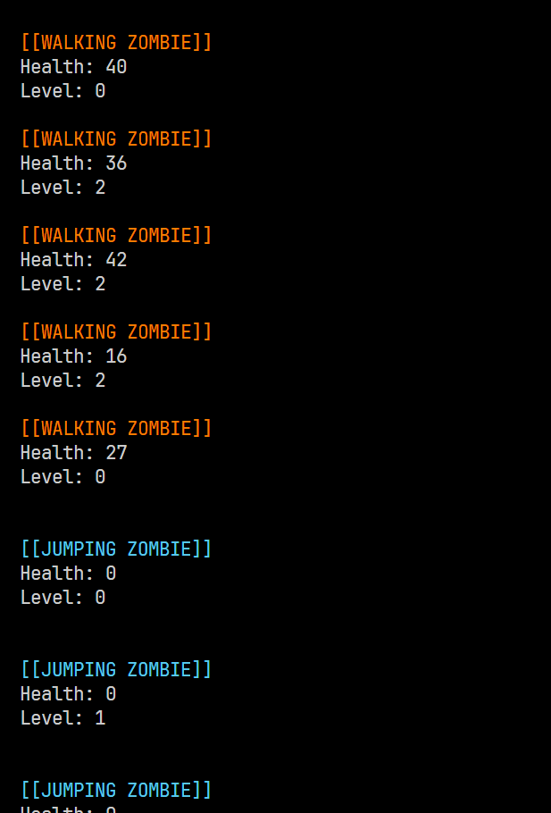

# Soal

Dalam suatu permainan, Zombie dan Barrier bisa dihancurkan oleh Plant dan bisa menyembuhkan diri. Terdapat dua jenis Zombie, yaitu Walking Zombie dan Jumping Zombie. Kedua Zombie tersebut memiliki cara penyembuhan yang berbeda, demikian juga cara penghancurannya, yaitu ditentukan oleh aturan berikut ini:

- Pada WalkingZombie
    - Penyembuhan : Penyembuhan ditentukan berdasar level zombie yang bersangkutan
        - Jika zombie level 1, maka setiap kali penyembuhan, health akan bertambah 20% 
        - Jika zombie level 2, maka setiap kali penyembuhan, health akan bertambah 30%
        - Jika zombie level 3, maka setiap kali penyembuhan, health akan bertambah 40%
    - Penghancuran : setiap kali penghancuran, health akan berkurang 20%

- Pada Jumping Zombie
    - Penyembuhan : Penyembuhan ditentukan berdasar level zombie yang bersangkutan
        - Jika zombie level 1, maka setiap kali penyembuhan, health akan bertambah 30%
        - Jika zombie level 2, maka setiap kali penyembuhan, health akan bertambah 40%
        - Jika zombie level 3, maka setiap kali penyembuhan, health akan bertambah 50%
    - Penghancuran : setiap kali penghancuran, health akan berkurang 10%

- Barrier hanya mempunyai kekuatan / strength, setiap kali terjadi penghancuran oleh plant maka strength akan berkurang 9.

- Lakukan pengecekan saat plant melakukan penghancuran pada zombie dan barrier, jika health pada zombie =0 atau strength pada barrier =0, maka akan muncul keterangan zombie atau barrier kalah.

Buat program dari class diagram di bawah ini!

Hasil:

